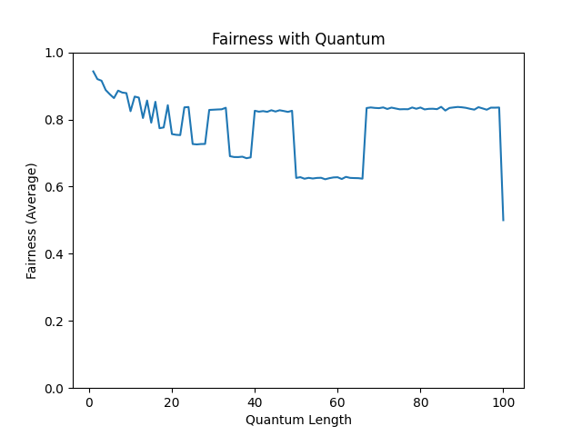
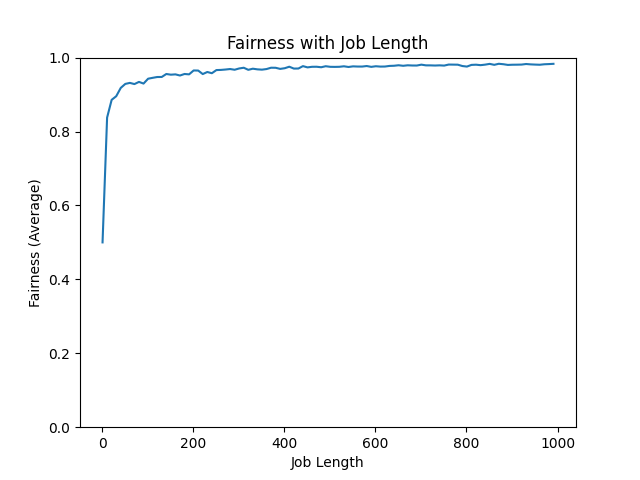
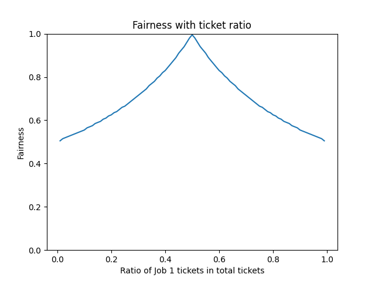

# ch9 Scheduling: Proportional Share Homework and Solution (Simulation)

If you just want to read the answers, that is a simple version for solutions, please visit [here](../solution.md).

Back to [contents](./README.md) for other chapter solution.

## Homework (Simulation)

This program, [`lottery.py`](../code/ch9/homework-simulation/lottery.py), allows you to see how a lottery scheduler works. See the [README](../code/ch9/homework-simulation/README.md) for details.

## Questions and Solutions

### 9.1

1. Compute the solutions for simulations with 3 jobs and random seeds of 1, 2, and 3.

For seed is equals 1, the results are as follows. 

```console
$ python3 lottery.py -s 1 -j 3
ARG jlist 
ARG jobs 3
ARG maxlen 10
ARG maxticket 100
ARG quantum 1
ARG seed 1

Here is the job list, with the run time of each job: 
  Job 0 ( length = 1, tickets = 84 )
  Job 1 ( length = 7, tickets = 25 )
  Job 2 ( length = 4, tickets = 44 )


Here is the set of random numbers you will need (at most):
Random 651593   (* Job 2)
Random 788724   (* Job 0, Job 0 done at time 2)
Random 93859    (* Job 1)
Random 28347    (* Job 2)
Random 835765   (* Job 2)
Random 432767   (* Job 2, Job 2 done at time 6)
Random 762280   (* Job 1)
Random 2106     (* Job 1)
Random 445387   (* Job 1)
Random 721540   (* Job 1)
Random 228762   (* Job 1)
Random 945271   (* Job 1, Job 1 done at time 6)
```

You can see detailed process by running:

```console
$ python3 lottery.py -s 1 -j 3 -c
```

For seed is equals 2, the results are as follows. 

```console
$ python3 lottery.py -s 2 -j 3
ARG jlist 
ARG jobs 3
ARG maxlen 10
ARG maxticket 100
ARG quantum 1
ARG seed 2

Here is the job list, with the run time of each job: 
  Job 0 ( length = 9, tickets = 94 )
  Job 1 ( length = 8, tickets = 73 )
  Job 2 ( length = 6, tickets = 30 )


Here is the set of random numbers you will need (at most):
Random 605944   (* Job 2)
Random 606802   (* Job 0)
Random 581204   (* Job 0)
Random 158383   (* Job 2)
Random 430670   (* Job 0)
Random 393532   (* Job 1)
Random 723012   (* Job 0)
Random 994820   (* Job 2)
Random 949396   (* Job 0)
Random 544177   (* Job 0)
Random 444854   (* Job 0)
Random 268241   (* Job 1)
Random 35924    (* Job 0)
Random 27444    (* Job 0, Job 0 done at time 14)
Random 464894   (* Job 1)
Random 318465   (* Job 1)
Random 380015   (* Job 2)
Random 891790   (* Job 1)
Random 525753   (* Job 1)
Random 560510   (* Job 2)
Random 236123   (* Job 1)
Random 23858    (* Job 1, Job 1 done at time 22)
Random 325143   (* Job 2, Job 2 done at time 23)
```

You can see detailed process by running:

```console
$ python3 lottery.py -s 2 -j 3 -c
```

For seed is equals 3, the results are as follows. 

```console
$ python3 lottery.py -s 3 -j 3
ARG jlist 
ARG jobs 3
ARG maxlen 10
ARG maxticket 100
ARG quantum 1
ARG seed 3

Here is the job list, with the run time of each job: 
  Job 0 ( length = 2, tickets = 54 )
  Job 1 ( length = 3, tickets = 60 )
  Job 2 ( length = 6, tickets = 6 )


Here is the set of random numbers you will need (at most):
Random 13168    (* Job 1)
Random 837469   (* Job 1)
Random 259354   (* Job 0)
Random 234331   (* Job 1, Job 1 done at time 4)
Random 995645   (* Job 0, Job 0 done at time 5)
Random 470263   (* Job 2)
Random 836462   (* Job 2)
Random 476353   (* Job 2)
Random 639068   (* Job 2)
Random 150616   (* Job 2)
Random 634861   (* Job 2, Job 2 done at time 11)
```

You can see detailed process by running:

```console
$ python3 lottery.py -s 3 -j 3 -c
```

### 9.2

2. Now run with two specific jobs: each of length 10, but one (job 0) with just 1 ticket and the other (job 1) with 100 (e.g., -l 10:1,10:100). What happens when the number of tickets is so imbalanced? Will job 0 ever run before job 1 completes? How often? In general, what does such a ticket imbalance do to the behavior of lottery scheduling?

Job 1 will run more frequently.

It is possible that Job 0 will be completed before Job 1, the probability is about 9.5%. Because if you want job 1 to complete before job 0 is run, job 1 needs to be run for the first 10 times, and its probability is (100/101)^10. Therefore, the probability of job 1 running before job 0 is completed is 1-(100/101)^10 is approximately equal to 9.5%.

### 9.3

3. When running with two jobs of length 100 and equal ticket allocations of 100 (-l 100:100,100:100), how unfair is the scheduler? Run with some different random seeds to determine the (probabilistic) answer; let unfairness be determined by how much earlier one job finishes than the other.

You should run `python3 lottery.py -s 1 -l 100:100,100:100 -c`

When the random seed is equal to 1, F = 196/200 = 0.98
When the random seed is equal to 2, F = 190/200 = 0.95
When the random seed is equal to 3, F = 196/200 = 0.98
When the random seed is equal to 4, F = 199/200 = 0.995
When the random seed is equal to 5, F = 181/200 = 0.905

### 9.4

4. How does your answer to the previous question change as the quantum size (-q) gets larger?

Generally, fairness will gradually decrease with the increase of quantum, but with the increase of quantum. The change of fairness in a certain quantum range will be more stable, because the total number of time slices required within a certain quantum range is the same. For example, when the quantum range is 50 to 65, two jobs can be completed by four runs.

The graph of fairness changes with quantum is as follows ([code](../code/ch9/homework-simulation/9-4-quantum.py)):



### 9.5

5. Can you make a version of the graph that is found in the chapter?
What else would be worth exploring? How would the graph look
with a stride scheduler?

For job length, the graph of fairness changes with job length is as follows ([code](../code/ch9/homework-simulation/9-5-length.py)):



For stride scheduler, the graph of fairness changes with th ratio of job 1 tickets in total tickets is as follows ([code](../code/ch9/homework-simulation/9-5-stride.py)):


