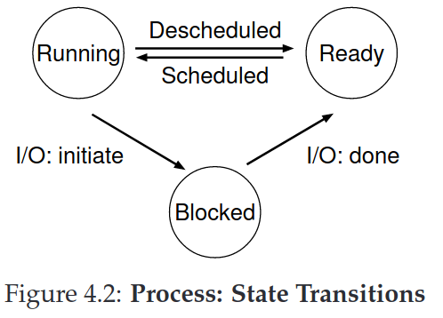

## Chapter 4. Processes

The definition of a process, informally, is quite simple: it is a running program.

### 4.1 The Abstraction: A Process

Process **machine state**: what a program can read or update when it is running. It including:
- *memory*. Instructions lie in memory. Thus the memory that the
process can address (called its **address space**) is part of the process.
- *register*. Many instructions explicitly read or update registers and thus clearly they are important to the execution of the process. Note that there are some particularly special registers that form part of this machine state.  For example, the **program counter (PC)** (sometimes called the instruction pointer or **IP**) tells us which instruction of the program will execute next; similarly a **stack pointer** and associated **frame pointer** are used to manage the stack for function parameters, local variables, and return addresses.
- *I/O information*. include a list of the files the process currently has open.

### 4.2 Process API

- **Create**. Create new processes.
- **Destroy**. Destroy processes forcefully. exit when complete, kill them
- **Wait**. Wait for a process to stop running.
- **Miscellaneous Control**. Other controls. For example, suspend or resume a process.
- **Status**. Get some status information about a process.

### 4.3 Process Creation: A Little More Detail

1. **Load** its code and any static data into memory, into the address space of the process. In early OS, it will done eagerly; while modern OSes perform the process lazily (based on the machinery of **paging** and **swapping**).
2. Some memory must be allocated for the program's **run-time stack**. (In C, it use stack for local variables, function parameters, and return addresses). The OS may also allocate some memory for the program’s **heap**. In C, the heap is used for explicitly requested dynamically-allocated data, such as space by calling `malloc()` and free it explicitly by calling `free()`.
3. The OS will also do some other initialization tasks, particularly as re-
lated to input/output (I/O). For example, in UNIX system, each process by default has three open file descriptors, for standard input, output, and error;
4. It thus has one last task: to start the program running at the entry point, namely `main()`. The OS transfers control of the CPU to the newly-created process, and thus the program begins its execution.

### 4.4 Process States

- **Running**: In the running state, a process is running on a processor. This means it is executing instructions.
- **Ready**: In the ready state, a process is ready to run but for some reason the OS has chosen not to run it at this given moment
- **Blocked**: In the blocked state, a process has performed some kind of operation that makes it not ready to run until some other event takes place. A common example: when a process initiates an I/O request to a disk, it becomes blocked and thus some other process can use the processor.

Sometimes a system will have an **initial state** that the process is in when it is being created. Also, a process could be placed in a **final state** where it has exited but has not yet been cleaned up (in UNIX-based systems, this is called the
zombie state1).

This final state can be useful as it allows other processes (usually the parent that created the process) to examine the return code of the process and see if the just-finished process executed successfully (usually, programs return zero in UNIX-based systems when they have accomplished a task successfully, and non-zero otherwise). When finished, the parent will make one final call (e.g., wait()) to wait for the completion of the child, and to also indicate to the OS that it can clean up any relevant data structures that referred to the now-extinct process.

### 4.5 Data Structures

- **Process List**. To track the state of each process.
- **Register Context**. hold for a stopped process, contents of its registers. Technique known as a **context switch**.

### 4.6 Summary

- The **process** is the major OS abstraction of a running program. At any point in time, the process can be described by its state: the contents of memory in its **address space**, the contents of CPU registers (including the **program counter** and **stack pointer**, among others), and information about I/O (such as open files which can be read or written).
- The **process API** consists of calls programs can make related to processes. Typically, this includes creation, destruction, and other useful calls.
- Processes exist in one of many different **process states**, including running, ready to run, and blocked. Different events (e.g., getting scheduled or descheduled, or waiting for an I/O to complete) transition a process from one of these states to the other.
- A **process list** contains information about all processes in the system. Each entry is found in what is sometimes called a **process control block (PCB)**, which is really just a structure that contains information about a specific process.

## Chapter 5. Process API

UNIX presents one of the most intriguing ways to create a new process with a pair of system calls: `fork()` and `exec()`. A third routine, `wait()`, can be used by a process wishing to wait for a process it has created to complete.

### 5.1 The `fork()` System Call

Each process has its **process identifier**, also known as a **PID**. The child process has its own copy of the address space, registers, PC, and so forth. 

The `fork()` system call is used to create a new process. The value it returns to the caller of `fork()` is different. Specifically, while the parent receives the PID of the newly-created child, the child receives a return code of zero.

Assuming run [Example p1](./code/ch5/sample/p1.c) on a system with a single CPU, the order of message printed by parent and child process cannot be determined. Because the **CPU scheduler**, it will leads to some interesting problems, particularly in **multi-threaded programs**.

### 5.2 The `wait()` System Call

Sometimes, it is useful for a parent to wait for a child process process to finish what it has been doing. This task is accomplished with the `wait()` system call (or its more complete sibling `waitpid()`);

In [Example p2](./code/ch5/sample/p2.c), the parent process calls `wait()` to delay its execution until the child finishes executing. So child will print message first, then parent print its message.

### 5.3 Finally, The `exec()` System Call

When you want to run a *different* program, `exec()` system call can do that. `exec()` loads code and static data from that executable and overwrites its current code segment (and current static data) with it; the heap and stack and other parts of the memory space of the program are re-initialized.

[Example p3](./code/ch5/sample/p3.c) will run the program `wc` on source file `p3.c`.

### 5.4 Why? Motivating the API

The separation of `fork()` and `exec()` is essential in building a UNIX shell, because it lets the shell run code after the call to `fork()` but before the call to `exec()`.

In most cases, the shell then figures out where in the file system the executable resides, calls `fork()` to create a new child process to run the command, calls some variant of `exec()` to run the command, and then waits for the command to complete by calling `wait()`. 

[Example p4](./code/ch5/sample/p4.c) shows a program that does redirection like `wc p4.c > newfile.txt`

UNIX pipes are implemented in a similar way, but with the `pipe()` system call. In this case, the output of one process is connected to an in-kernel pipe (i.e., queue), and the input of another process is connected to that same pipe;

### 5.5 Process Control And Users

There are a lot of other interfaces for interacting with processes in UNIX systems. For example, the `kill()` system call is used to send signals to a process, including directives to pause, die, and other useful imperatives. For example, Ctrl-c sends a `SIGINT`(interrupt) to process, Ctrl-z sends a `SIGTSTP`(stop) signnal to pause the process.

Modern systems include a strong conception of the notion of a user. Not everyone on system can send any signal.

### 5.6 Useful Tools

There are many command-line tools that are useful as well. For example, `man` can help you read **man pages**. `ps` allows you to see which processes are running. `top` displays the processes of the system and how much CPU and other resources they are eating up. `kill` can send arbitrary signals to processes.

### 5.7 Summary

- Each process has a name; in most systems, that name is a number known as a **process ID (PID)**.
- The `fork()` system call is used in UNIX systems to create a new process. The creator is called the **parent**; the newly created process is called the **child**. As sometimes occurs in real life [J16], the child process is a nearly identical copy of the parent.
- The `wait()` system call allows a parent to wait for its child to complete execution.
- The `exec()` family of system calls allows a child to break free from its similarity to its parent and execute an entirely new program.
- A UNIX shell commonly uses `fork()`, `wait()`, and `exec()` to launch user commands; the separation of fork and exec enables features like **input/output redirection**, **pipes**, and other cool features, all without changing anything about the programs being run.
- Process control is available in the form of **signals**, which can cause jobs to stop, continue, or even terminate.
- Which processes can be controlled by a particular person is encapsulated in the notion of a **user**; the operating system allows multiple users onto the system, and ensures users can only control their own processes.
- A **superuser** can control all processes (and indeed do many other things); this role should be assumed infrequently and with caution for security reasons.

## Chapter 6. Direct Scheduling

Time sharing(run one process for a while, then run another one) has a few challenges:
obtain high *performance* and maintain *control*.

### 6.1 Basic Technique: Limited Direct Execution

**Limited Direct Execution**: "direct execution without limits" means just run the program directly on the CPU. But it will brings some problems.

### 6.2 Problem #1: Restricted Operations

A process must be able to perform I/O and some other restricted operations, but without giving the process complete control over the system.

The OS introduces a new processor mode to solve it.
- **user mode**: code that runs in user mode is restricted in what it can do. For example, it can't issue I/O requests.
- **kernel mode**: the operating system (or kernel) runs in this mode. In this mode, code that runs can do what it likes.

**system calls** allow the kernel to carefully expose certain key pieces of functionality to user programs, such as accessing the file system, creating and destroying processes, communicating with other processes.

To execute a system call, a program must execute a special **trap** instruction. This instruction simultaneously jumps into the kernel and raises the privilege level to kernel mode. once in the kernel, the system can now perform whatever privileged operations are needed (if allowed), and thus do the required work for the calling process. When finished, the OS calls a special **return-from-trap** instruction, which, as you might expect, returns into the calling user program while simultaneously reducing the privilege level back to user mode.

The hardware needs to be a bit careful when executing a trap, in that it
must make sure to save enough of the caller’s registers in order to be able
to return correctly when the OS issues the **return-from-trap** instruction.

The kernel must carefully control what code executes upon a trap, so the kernel does so by setting up a **trap table** at boot time. When the machine boots up, it does so in privileged (kernel) mode, and thus is free to configure machine hardware as need be. The OS informs the hardware of the locations of these **trap handlers**.

To specify the exact system call, a **system-call number** is usually assigned to each system call. The user code is thus responsible for placing the desired system-call number in a register or at a specified location on the stack; the OS, when handling the system call inside the trap handler, examines this number, ensures it is valid, and, if it is, executes the corresponding code. This level of indirection serves as a form of **protection**; user code cannot specify an exact address to jump to, but rather must   request a particular service via number.

One last aside: being able to execute the instruction to tell the hardware where the trap tables are is a very powerful capability. Thus, as you might have guessed, it is also a privileged operation.

There are two phases in the limited direct execution (LDE) protocol.
1. In the first(at boot time), the kernel initializes the trap table, and the CPU remembers its location for subsequent use. The kernel does so via a privileged instruction.
2. In the second(when running a process), rge kernel sets up a few things before using a return-form-trap to start the execution of the process; this switches the CPU to user mode and begins running the process. When the process wishes to issue a system call, it traps back into the OS, which handles it and once again returns control via a return-from-trap to the process. 

### 6.3 Problem #2: Switching Between Processes

The next problem with direct execution is achieving a switch between
processes. It actually is a little bit tricky: specifically, if a process is
running on the CPU, this by definition means the OS is not running. How can the operating system regain control of the CPU so that it can switch between processes?

#### A Cooperative Approach: Wait For System Calls

In this style, the OS *trusts* the processes of the system to behave reasonably. Systems like this often include an explicit **yield** system call, which does nothing except to transfer control to the OS so it can run other processes.

Applications also transfer control to the OS when they do something illegal. For example, an application divides by zero, or tries to access memory that it shouldn't be able to access, it will generate a **trap** to the OS.

In a cooperative scheduling system, the OS regains control of the CPU by waiting for a system call or an illegal operation of some kind to take place.

#### A Non-Cooperative Approach: The OS Takes Control

The OS regained control of the CPU when raising **an timer interrupt** by timer device, and thus can do what it pleases: stop the current process, and start a different one.

First, the OS must inform the hardware of which code to run when the timer interrupt occurs; Second, the OS must start the timer during the boot sequence.

Note that the hardware has some responsibility when an interrupt occurs, in particular to save enough of the state of the program that was running when the interrupt occurred such that a subsequent return-from-trap instruction will be able to resume the running program correctly.

#### Saving and Restoring Context

A **scheduler** is a part of the operating system, to decide whether to continue running the currently-running process, or switch to a different one. If the decision is made to switch, the OS then executes a low-level piece of code which we refer to as a **context switch**. A context switch is conceptually simple: all the OS has to do is save a few register values for the currently-executing process (onto its kernel stack, for example) and restore a few for the soon-to-be-executing process (from its kernel
stack). 

Note that there are two types of register saves/restores that happen during this protocol. The first is when the timer interrupt occurs; in this case, the user registers of the running process are implicitly saved by the hardware, using the kernel stack of that process. The second is when the OS decides to switch from A to B; in this case, the kernel registers are explicitly saved by the software (i.e., the OS), but this time into memory in the process structure of the process.

### 6.4 Worried About Concurrency?

Operating systems also have developed a number of sophisticated **locking** schemes to protect concurrent access to internal data structures. As we’ll see more about it in the next piece of this book on concurrency.

### 6.5 Summary

- The CPU should support at least two modes of execution: a restricted **user mode** and a privileged (non-restricted) **kernel mode**.
- Typical user applications run in user mode, and use a **system call** to **trap** into the kernel to request operating system services.
- The trap instruction saves register state carefully, changes the hardware status to kernel mode, and jumps into the OS to a pre-specified destination: the **trap table**.
- When the OS finishes servicing a system call, it returns to the user program via another special **return-from-trap** instruction, which reduces privilege and returns control to the instruction after the trap that jumped into the OS.
- The trap tables must be set up by the OS at boot time, and make sure that they cannot be readily modified by user programs. All of this is part of the **limited direct execution** protocol which runs programs efficiently but without loss of OS control.
- Once a program is running, the OS must use hardware mechanisms to ensure the user program does not run forever, namely the **timer interrupt**. This approach is a **non-cooperative** approach to CPU scheduling.
- Sometimes the OS, during a timer interrupt or system call, might wish to switch from running the current process to a different one, a low-level technique known as a **context switch**.

