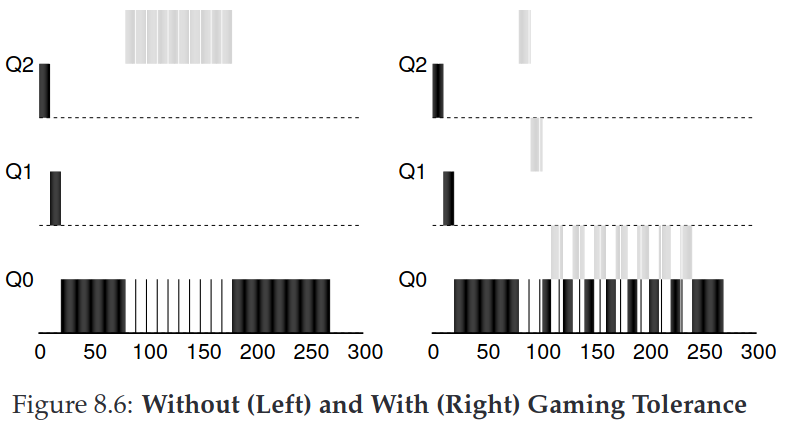

## Chapter 8. Scheduling: The Multi-Level Feedback Queue

The **Multi-Level Feedback Queue(MLFQ)** was first described by Corbato(Turing Award 1990) et al. in 1962.

The fundamental problem MLFQ tries to address is two-fold. Without a *priori*
knowledge of job length , First, it would like to optimize *turnaround time*. Second, MLFQ would like to make a system fell responsive to interactive users and thus minimize *response time*. 

The multi-level feedback queue is an excellent example of a system that
learns from the past to predict the future. 

### 8.1 MLFQ: Basic Rules

The MLFQ has a number of distinct **queues**, each assigned a different **priority level**. MLFQ uses priorities to decide which job should run at a given time: a job with higher priority (i.e., a job on a higher queue) is chosen to run. Of course, more than one job may be on a given queue, and thus have the same priority. In this case, we will just use round-robin scheduling among those jobs.

The first two basic rules for MLFQ:
- **Rule 1**: If Priority(A) > Priority(B), A runs (B doesn't)
- **Rule 2**: If Priority(A) = Priority(B), A & B run in RR.

Rather than giving a fixed priority to each job, MLFQ *varies* the priority of a job based on its *observed behavior*. If, for example, a job repeatedly relinquishes the CPU while waiting for input from the keyboard, MLFQ will keep its priority high, as this is how an interactive process might behave. If, instead, a job uses the CPU intensively for long periods of time, MLFQ will reduce its priority. In this way, MLFQ will try to *learn* about processes as they run, and thus use the *history* of the job to predict its *future* behavior.

### 8.2 Attempt #1: How To Change Priority

We must keep in mind our workload: a mix of interactive jobs that are short-running (and may frequently relinquish the CPU), and some longer-running “CPU-bound” jobs that need a lot of CPU time but where response time isn’t important. Here is our first attempt at a priority-adjustment algorithm:

- **Rule 3**: When a job enters the system, it is placed at the highest priority(the topmost queue)
- **Rule 4a**: If a jobs uses up an entire time slice while running, its priority is *reduced* (i.e, it moves down one queue)
- **Rule 4b**: If a job gives up the CPU before the time slice is up, it stays at the *same* priority level.

#### Example 1: A Single Long-Running Job


Figure 8.2 shows a single long-running job in MLFQ. the job enters at the highest priority (Q2). After a single time-slice of 10 ms, the scheduler reduces the job’s priority by one, and thus the job is on Q1. After running at Q1 for a time slice, the job is finally lowered to the lowest priority in the system (Q0), where it remains.

#### Example 2: Along Came A Short Job

In this example, there are two jobs: A, which is a long-running CPU-intensive job, and B, which is a short-running interactive job. 


Figure 8.3 plots the results of this scenario. A (shown in black) is running along in the lowest-priority queue (as would any long-running CPU-intensive jobs); B (shown in gray) arrives at time T = 100, and thus is inserted into the highest queue; as its run-time is short (only 20 ms), B completes before reaching the bottom queue, in two time slices; then A resumes running (at low priority).

The major goals of the algorithm: because it doesn’t know whether a job will be a short job or a long-running job, it first assumes it might be a short job, thus giving the job high priority. If it actually is a short job, it will run quickly and complete; if it is not a short job, it will slowly move down the queues, and thus soon prove itself to be a long-running more batch-like process. In this manner, MLFQ approximates SJF.

#### Example 3: What About I/O?

As Rule 4b states above,  if an interactive job, for example, is doing a lot of I/O (say by waiting for user input from the keyboard or mouse), it will relinquish the CPU before its time slice is complete.


Figure 8.4 shows an example of how this works, with an interactive job B (shown in gray) that needs the CPU only for 1 ms before performing an I/O competing for the CPU with a long-running batch job A (shown in black). The MLFQ approach keeps B at the highest priority because B keeps releasing the CPU; if B is an interactive job, MLFQ further achieves its goal of running interactive jobs quickly.

#### Problems with Our Current MLFQ

First, there is the problem of **starvation**: if there are “too many” interactive jobs in the system, they will combine to consume all CPU time, and thus long-running jobs will never receive any CPU time (they starve).

Second, a smart user could rewrite their program to **game the scheduler**. The algorithm we have described is susceptible to the following attack: before the time slice is over, issue an I/O operation (to some file you don’t care about) and thus relinquish the CPU; doing so allows you to remain in the same queue, and thus gain a higher percentage of CPU time. When done right (e.g., by running for 99% of a time slice before relinquishing the CPU), a job could nearly monopolize the CPU.

Finally, a program may *change its behavior* over time;

### 8.3 Attempt #2: The Priority Boost

The simple idea here is to periodically **boost** the priority of all the jobs in system. There are many ways to achieve this, but let’s just do something simple: throw them all in the topmost queue; hence, a new rule:

- **Rule 5**: After some time period S, move all the jobs in the system to topmost queue.

Such new rule solves two problems mentioned above at once. First, processes are guaranteed not to starve: by sitting in the top queue, a job will share the CPU with other high-priority jobs in a round-robin fashion, and thus eventually receive service. Second, if a CPU-bound job has become interactive, the scheduler treats it properly once it has received the priority boost.


Figure 8.5 shows an example. On the left, there is no priority boost, and thus the long-running job gets starved once the two short jobs arrive; on the right, there is a priority boost every 50 ms and thus we at least guarantee that the long-running job will make some progress, getting boosted to the highest priority every 50 ms and thus getting to run periodically.

There is an obvious question: what should S be set to?  John Ousterhout used to call such values in systems voo-doo constants, because they seemed to require some form of black magic to set them correctly. Unfortunately, S has that flavor. If it is set too high, long-running jobs could starve; too low, and interactive jobs may not get a proper share of the CPU. TIP: Avoid voo-doo constants is a good idea whenever possible(**Ousterhout’s Law**) **(TODO Why?)**

### 8.4 Attempt #3: Better Accounting

How to prevent gaming of our scheduler? The solution here is to perform better accounting of CPU time at each level of the MLFQ. Instead of forgetting how much of a time slice a process used at a given level, the scheduler should keep track; once a process has used its allotment, it is demoted to the next priority queue. Whether it uses the time slice in one long burst or many small ones does not matter. We thus rewrite Rules 4a and 4b to the following single rule:

- **Rule 4**: Once a job uses up its time allotment at a given level (regardless of how many times it has given up the CPU), its priority is reduced (i.e, it moves down one queue).



Figure 8.6 shows an example what happens when a workload tries to game the scheduler with the old Rules 4a and 4b (on the left) as well the new anti-gaming Rule 4. Without any protection from gaming, a process can issue an I/O just before a time slice ends and thus dominate CPU time. With such protections in place, regardless of the I/O behavior of the process, it slowly moves down the queues, and thus cannot gain an unfair share of the CPU.

### 8.5 Tuning MLFQ And Other Issues

One big question is how to **parameterize** such a scheduler. For example, how many queues should there be? How big should the time slice be per queue? How often should priority be boosted in order to avoid starvation and account for changes in behavior? There are no easy answers to these questions, and thus only some experience with workloads and subsequent tuning of the scheduler will lead to a satisfactory balance.


For example, most MLFQ variants allow for varying time-slice length across different queues. The high-priority queues are usually given short time slices, they are comprised of interactive jobs, after all, and thus quickly alternating between them makes sense. The low-priority queues, in contrast, contain long-running jobs that are CPU-bound; hence, longer time slices work well. As Figure 8.7 shown.

Solaris MLFQ implementation -- Default values for the table are 60 queues, with slowly increasing time-slice lengths from 20 milliseconds (highest priority) to a few hundred milliseconds (lowest), and priorities boosted around every 1 second or so.

FreeBSD scheduler use a formula to calculate the current priority level of a job, basing it on how much CPU the process has used.

Finally,  many schedulers have a few other features that you might encounter. For example, some schedulers reverse the highest priority levels for operating system work. Some systems also provide interfaces to allow users or administrators to provide some hints to help the OS set priorities(e.g. with `nice`, `madvise`).

### 8.6 MLFQ: Summary

Multi-Level Feedback Queue(MLFQ) has multiple levels of queues, and uses feedback to determine the priority of a given job. History is its guide: pay attention to how jobs
behave over time and treat them accordingly.

The refined set of MLFQ rules, spread throughout the chapter, are reproduced here for your viewing pleasure:
- Rule 1: If Priority(A) > Priority(B), A runs (B doesn’t).
- Rule 2: If Priority(A) = Priority(B), A & B run in round-robin fashion using the time slice (quantum length) of the given queue.
- Rule 3: When a job enters the system, it is placed at the highest priority (the topmost queue).
- Rule 4: Once a job uses up its time allotment at a given level (regardless of how many times it has given up the CPU), its priority is reduced (i.e., it moves down one queue).
- Rule 5: After some time period S, move all the jobs in the system to the topmost queue.

MLFQ is interesting for the following reason: instead of demanding a priori knowledge of the nature of a job, it observes the execution of a job and prioritizes it accordingly. 

## Chapter 9. Scheduling: Proportional Share

**Proportional-share(fair-share)** scheduler: it try to guarantee that each job obtain a certain percentage of CPU time. An excellent early example is **lottery scheduling**.

The basic idea of **lottery scheduling** is quite simple: every so often, hold a lottery to determine which process should get to run next; processes that should run more often should be given more chances to win the lottery. 

### 9.1 Basic Concept: Tickets Represent Your Share

**Tickets** are used to represent the share of a resource that a process should receive. The percent of tickets that a process has represents its share of the system resource in question. For example, A has 75 tickets while B has 25 tickets, Thus, A receive 75% of the CPU and B the remaining 25%.

Holding a lottery is straightforward: the scheduler must know how many total tickets there are (in our example, there are 100). The scheduler then picks a winning ticket, which is a number from 0 to 991. Assuming A holds tickets 0 through 74 and B 75 through 99, the winning ticket simply determines whether A or B runs. The scheduler then loads the state of that winning process and runs it. The longer these two jobs compete, the more likely they are to achieve the desired percentages.

One of the most beautiful aspects of lottery scheduling is its use of randomness. Random approaches have at least three advantages over more traditional decisions. First, random often avoids strange corner-case behaviors that a more traditional algorithm may have trouble handling. Second, random also is lightweight, requiring little state to track alternatives. Finally, random can be quite fast.

In fact, tickets can be applied much more broadly. For example, on virtual memory management for hypervisors, represent a guest operating system's share of memory. Thus, if you are ever in need of a mechanism to represent a proportion of ownership, this concept just might be ... (wait for it) ... the ticket.

### 9.2 Ticket Mechanisms

Lottery scheduling also provides a number of mechanisms to manipulate tickets in different and sometimes useful ways. One way is with the concept of **ticket currency**. Currency allows a user with a set of tickets to allocate tickets among their own jobs in whatever currency they would like; the system then automatically converts said currency into the correct global value. 

For example, A running two jobs, A1 and A2, then give them each 500 ticks. B running one job, B1 and give it 10 tickets. First, the system convert 500 each in A to 50 each, B1's 10 tickets is converted to 100 tickets, then the lottery held over the global ticket currency (200 total) to determine which job runs.

Another useful mechanism is **ticket transfer**. With transfers, a process can temporarily hand off its tickets to another process. This ability is especially useful in a client/server setting, where a client process sends a message to a server asking it to do some work on the client’s behalf. To speed up the work, the client can pass the tickets to the server and thus try to maximize the performance of the server while the server is handling the client’s request. When finished, the server then transfers the tickets back to the client and all is as before.

Finally, **ticket inflation** can sometimes be a useful technique. With inflation, a process can temporarily raise or lower the number of tickets it owns. In a competitive scenario with processes that do not trust each other, this make little sense, because one greedy process could give itself a vast number of tickets. Rather, ticket inflation can be applied in an environment where a group of processes trust one another; in such a case, if any one process knows it needs more CPU time, it can boost its ticket value as a way to reflect that need to the system, all without communicating with any other processes.

### 9.3 Implementation

Probably the most amazing thing about lottery scheduling is the simplicity of its implementation. To make a scheduling decision, we first have to pick a random number (the winner) from the total number of tickets. Then, we simply traverse the list, with a simple counter used to help us find the winner.

The Lottery Scheduling Decision code is as follows. Adding each ticket value to `counter`
until the value exceeds `winner`. Once that is the cache, the current list element is the winner.

```c
// counter: used to track if we’ve found the winner yet
int counter = 0;

// winner: use some call to a random number generator to
// get a value, between 0 and the total # of tickets
int winner = getrandom(0, totaltickets);

// current: use this to walk through the list of jobs
node_t *current = head;
while (current) {
    counter = counter + current->tickets;
    if (counter > winner)
        break; // found the winner
    current = current->next;
}
// ’current’ is the winner: schedule it...
```

To make this process most efficient, it might generally be best to organize the list in sorted order, from the highest number of tickets to the lowest. The ordering does not affect the correctness of the algorithm; however, it does ensure in general that the fewest number of list iterations are taken, especially if there are a few processes that possess most of the tickets.

[The sample code for lottery scheduling](./code/ch9/sample/lottery.c)

### 9.4 An Example

Assuming there are two jobs competing against one another, each with the same number of tickets(100) and the same run time(R, which we will vary).

We define a simple **fairness metric(F)**, which is simply the time the first job completes divided by the time that the second job completes. For example, if R = 10, the first job finishes at time 10, the second job finishes at time 20. F = 10/20 = 0.5. Our goal to get a perfectly fair scheduler would achieve F=1.


Figure 9.2 plots the average fairness as the length of the two jobs (R) is varied from 1 to 1000 over thirty trials. As you can see from the graph, when the job length is not very long, average fairness can be quite low. Only as the jobs run for a significant number of time slices does the lottery scheduler approach the desired fair outcome.

### 9.5 How To Assign Tickets

One problem we have not addressed with lottery scheduling is: how to assign tickets to jobs? This problem is a tough one, because of course how the system behaves is strongly dependent on how tickets are allocated. One approach is to assume that the users know best; in such a case, each user is handed some number of tickets, and a user can allocate tickets to any jobs they run as desired. However, this solution is a non-solution: it really doesn’t tell you what to do. Thus, given a set of jobs, the “ticket-assignment problem” remains open.

### 9.6 Stride Scheduling

**Stride Scheduling** is a deterministic fair-share scheduler. Each job in the system has a stride, which is inverse in proportion to the number of tickets it has. We can compute the stride of each by dividing some large number by the number of tickets each process has been assigned. We call this value the **stride** of each process; every time a process runs, we will increment a counter for it (called its **pass** value) by its stride to track its global progress. For example, A, B, and C, with 100, 50, and 250 tickets. the stride value for A, B, C is 100, 200, and 40.

The scheduler then uses the stride and pass to determine which process should run next. The basic idea is simple: at any given time, pick the process to run that has the lowest pass value so far; when you run a process, increment its pass counter by its stride. The pseudocode is as follows:

```c
curr = remove_min(queue);   // pick client with min pass
schedule(curr);             // run for quantum
curr->pass += curr->stride; // update pass using stride
insert(queue, curr);        // return curr to queue
```


As figure 9.3 shown, C ran five times, A twice, and B just once. Lottery scheduling achieves the proportions probabilistically over time; stride scheduling gets them exactly right at the end of each scheduling cycle.

Lottery scheduling has one nice property that stride scheduling does not: no global state. Imagine a new job enters in the middle of our stride scheduling example above; what should its pass value be? Should it be set to 0? If so, it will monopolize the CPU. With lottery scheduling, there is no global state per process; we simply add a new process with whatever tickets it has, update the single global variable to track how many total tickets we have, and go from there. In this way, lottery makes it much easier to incorporate new processes in a sensible manner.

### 9.7 The Linux Completely Fair Scheduler (CFS)

The Linux **Completely Fair Scheduler**(or **CFS**) achieves fair-share scheduling, but does so in a highly efficient and scalable manner.

To achieve its efficiency goals, CFS aims to spend very little time making scheduling decisions, through both its inherent design and its clever use of data structures well-suited to the task. For example, in a study of Google data centers, Kanev et al. show that even after aggressive optimization, scheduling uses about 5% of overall data center CPU time. Reducing that overhead as much as possible is thus a key goal in modern scheduler architecture.

#### Basic Operation

To fairly dived a CPU evenly among all competing processes, CFS takes a simple counting-based technique known as **virtual runtime(vruntime)**.

As each process runs, it accumulates `vruntime`. In the most basic case, each process’s `vruntime` increases at the same rate, in proportion with physical (real) time. When a scheduling decision occurs, CFS will pick the process with the lowest `vruntime` to run next.

If CFS switches processes too often, fairness is increased, but at the cost of performance (too much context switching); If CFS switches less often, performance is increased (reduced context switching), but at the cost of near-term fairness.

CFS manages this tension through various control parameters. The first is `sched_latency`. CFS uses this value to determine how long one process should run before considering a switch (effectively determining its time slice but in a dynamic fashion). A typical `sched_latency` value is 48 (milliseconds); CFS divides this value by the number (n) of processes running on the CPU to determine the time slice for a process, and thus ensures that over this period of time, CFS will be completely fair. For example, if n = 4, then `sched_latency` will be 12ms, that means a per-process time slice is 12ms.

But what if there are too many processes running? CFS add another parameter `min_granularity`, which is usually set to a value like 6 ms. CFS will never set the time slice of a process to less than this value, ensuring that not too much time is
spent in scheduling overhead. For example, if n = 10, although `sched_latency` is 4.8ms, `min_granularity` is 6ms, so the time slice of each process is 6ms instead.

Note that CFS utilizes a periodic timer interrupt, which means it can only make decisions at fixed time intervals. This interrupt goes off frequently (e.g., every 1 ms), giving CFS a chance to wake up and determine if the current job has reached the end of its run. If a job has a time slice that is not a perfect multiple of the timer interrupt interval, that is OK; CFS tracks vruntime precisely, which means that over the long haul, it will eventually approximate ideal sharing of the CPU.

#### Weighting (Niceness)

CFS also enables controls process priority through a classic UNIX mechanism known as the **nice** level of a process. The nice parameter can be set anywhere from -20 to +19 for a process, with a default of 0. Positive nice values imply *lower* priority and negative values imply *higher* priority; 

CFS maps the nice value of each process to a weight, as shown here:

```c
static const int prio_to_weight[40] = {
/* -20 */ 88761, 71755, 56483, 46273, 36291,
/* -15 */ 29154, 23254, 18705, 14949, 11916,
/* -10 */ 9548, 7620, 6100, 4904, 3906,
/* -5  */ 3121, 2501, 1991, 1586, 1277,
/* 0   */ 1024, 820, 655, 526, 423,
/* 5   */ 335, 272, 215, 172, 137,
/* 10  */ 110, 87, 70, 56, 45,
/* 15  */ 36, 29, 23, 18, 15,
};
```

These weights allow us to compute the effective time slice of each process (as we did before), but now accounting for their priority differences. The formula used to do so is as follows, assuming n processes:


In addition to generalizing the time slice calculation, the way CFS calculates vruntime must also be adapted. Here is the new formula, which takes the actual run time that process i has accrued (runtime<sub>i</sub>) and scales it inversely by the weight of the process, by dividing the default weight of 1024 (weight<sub>0</sub>) by its weight, weight<sub>i</sub>.


#### Using Red-Black Trees

CFS find the next job to run by keeping processes in a **red-blck tree**. A red-black tree is one of many types of balanced trees. CFS **does not** keep *all* process in this structure; rather, **only running** (or **runnable**) processes are kept therein. Processes are ordered in the tree by `vruntime`, and most operations (such as insertion and deletion) are logarithmic in time, i.e., O(log n).

#### Dealing With I/O And Sleeping Processes

One problem with picking the lowest `vruntime` to run next arises with jobs that have gone to sleep for a long period of time. When a job finish I/O and ready to run. CFS will sets the runtime of that job to the minimum value found in the tree(remember, the tree only contains running jobs). In this way, CFS avoids starvation, but not without a cost: jobs that sleep for short periods of time frequently do not ever get their fair share of the CPU.

#### Other CFS Fun

CFS has many other features, too many to discuss at this point in the book. It includes numerous heuristics to improve cache performance, has strategies for handling multiple CPUs effectively  (as discussed later in the book), can schedule across large groups of processes (instead of treating each process as an independent entity), and many other interesting features.

### 9.8 Summary

We have introduced the concept of proportional-share scheduling and briefly discussed three approaches: lottery scheduling, stride scheduling, and the Completely Fair Scheduler (CFS) of Linux. Lottery uses randomness in a clever way to achieve proportional share; stride does so deterministically. CFS, the only “real” scheduler discussed in this chapter, is a bit like weighted round-robin with dynamic time slices, but built to scale and perform well under load; to our knowledge, it is the most widely used fair-share scheduler in existence today.

No scheduler is a panacea, and fair-share schedulers have their fair share of problems. One issue is that such approaches do not particularly mesh well with I/O; as mentioned above, jobs that perform I/O occasionally may not get their fair share of CPU. Another issue is that they leave open the hard problem of ticket or priority assignment, i.e., how do you know how many tickets your browser should be allocated, or to what nice value to set your text editor? Other general-purpose schedulers (such as the MLFQ we discussed previously, and other similar Linux schedulers) handle these issues automatically and thus may be more easily deployed.
