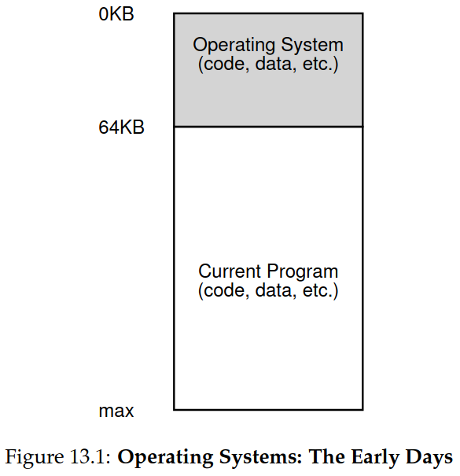
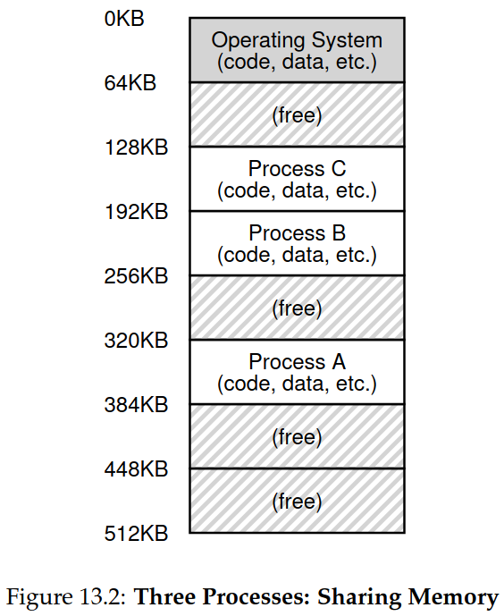
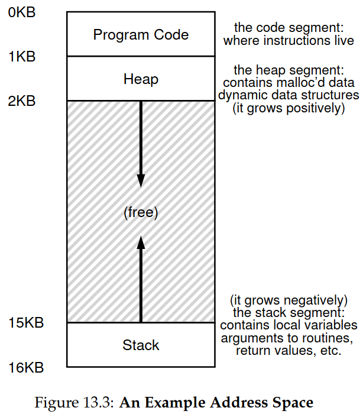

## Chapter 13. The Abstraction: Address Space (Note)

### 13.1 Early Systems



As shown in Figure 13.1, the OS was a set of routines (a library, really) that sat in memory (starting at physical address 0 in this example), and there would be one running program (a process) that currently sat in physical memory (starting at physical address 64k in this example)

### 13.2 Multiprogramming and Time Sharing

In the era of **multiprogramming**, multiple processes were ready to run at a given time, and the OS would switch between them, for example when one decided to perform an I/O. Doing so increased the effective utilization of the CPU. Because **efficiency** is particularly important in those days.

In the era of **time sharing**, the notion of **interactivity** became important, One way to implement time sharing would be to run one process for a short while, giving it full access to all memory (Figure 13.1), then stop it, save all of its state to some kind of disk (including all of physical memory), load some other process’s state, run it for a while.

Unfortunately, this approach has a big problem: it is way too slow, particularly as memory grows. While saving and restoring register-level state (the PC, general-purpose registers, etc.) is relatively fast, saving the entire contents of memory to disk is brutally non-performant. Thus, what we’d rather do is leave processes in memory while switching between them, allowing the OS to implement time sharing efficiently. 



As shown in Figure 13.2, there are three processes(A,B,C) and each of them have a small part of the 512KB physical memory craved out for them.

Allowing multiple programs to reside concurrently in memory makes **protection** an important issue;  you don’t want a process to be able to read, or worse, write some other process’s memory.

### 13.3 The Address Space

The OS create an **easy to use** abstraction of physical memory, we call this abstraction the **address space**, and it is the running program’s view of memory in the system.

The address space of a process contains all of the memory state of the running program. For example, the **code** of the program(instructions), the **stack** of program to keep track of where it is in the function call chain as well as to allocate local variables and pass parameters and return values to and from routines, the **heap** of program is used for dynamically-allocated, user-managed memory, such as that you might receive from a call to `malloc()` in C or `new` in an object-oriented language such as C++ or Java. 



As shown in Figure 13.3, the program code lives at the top of the address space(starting at 0 in this example, and is packed into the first 1K of the address space). Code is static (and thus easy to place in memory),  so we can place it at the top of the address space and know that it won’t need any more space as the program runs. Next, we have the two regions of the address space that may grow (and shrink) while the program runs. Those are the heap (at the top) and the stack (at the bottom). We place them like this because each wishes to be able to grow, and by putting them at opposite ends of the address space, we can allow such growth: they just have to grow in opposite directions.  However, this placement of stack and heap is just a convention; you could arrange the address space in a different way if you’d like 

Of course, when we describe the address space, what we are describing is the abstraction that the OS is providing to the running program. The program really isn’t in memory at physical addresses 0 through 16KB; rather it is loaded at some arbitrary physical address(es).

we say the OS is **virtualizing memory**, because the running program thinks it is loaded into memory at a particular address (say 0) and has a potentially very large address space (say 32-bits or 64-bits); the reality is quite different. For example, process A in Figure 13.2 tries to perform a load at address 0 (which we will call a virtual address), somehow the OS, in tandem with some hardware support, will have to make sure the load doesn’t actually go to physical address 0 but rather to physical address 320KB (where A is loaded into memory).

### 13.4 Goals

We need some goals to guide us how OS virtualize memory better. 

One major goal of a virtual memory (VM) system is **transparency**. The OS should implement virtual memory in a way that is invisible to the running program. Thus, the program shouldn’t be aware of the fact that memory is virtualized; rather, the program behaves as if it has its own private physical memory. 

Another goal of VM is **efficiency**. The OS should strive to make the virtualization as efficient as possible, both in terms of time (i.e., not making programs run much more slowly) and space (i.e., not using too much memory for structures needed to support virtualization).

Finally,  a third VM goal is **protection**. The OS should make sure to protect processes from one another as well as the OS itself from processes. Protection thus enables us to deliver the property of **isolation** among processes; each process should be running in its own isolated cocoon, safe from the ravages of other faulty or even malicious processes.

### 13.5 Summary

We have seen the introduction of a major OS subsystem: virtual memory. The VM system is responsible for providing the illusion of a large, sparse, private address space to programs, which hold all of their instructions and data therein. The OS, with some serious hardware help, will take each of these virtual memory references, and turn them into physical addresses, which can be presented to the physical memory in order to fetch the desired information. The OS will do this for many processes at once, making sure to protect programs from one another, as well as protect the OS. The entire approach requires a great deal of mechanism (lots of low-level machinery) as well as some critical policies to work; we’ll start from the bottom up, describing the critical mechanisms first. And thus we proceed!

### Aside: Every address you see is virtual

Ever write a C program that prints out a pointer? The value you see (some large number, often printed in hexadecimal), is a **virtual address**. So never forget: if you print out an address in a program, it’s a virtual one, an illusion of how things are laid out in memory; only the OS (and the hardware) knows the real truth.

Here’s a little program (`va.c`) that prints out the locations of the `main()` routine (where code lives), the value of a heap-allocated value returned from `malloc()`, and the location of an integer on the stack:

```c
#include <stdio.h>
#include <stdlib.h>
int main(int argc, char *argv[]) {
    printf("location of code : %p\n", main);
    printf("location of heap : %p\n", malloc(100e6));
    int x = 3;
    printf("location of stack: %p\n", &x);
    return x;
}
```

When run on a 64-bit Mac, we get the following output:

```
location of code : 0x1095afe50
location of heap : 0x1096008c0
location of stack: 0x7fff691aea64
```
