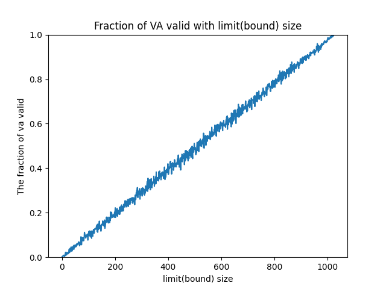

# Chapter 15. Mechanism: Address Translation Homework and Solution (Simulation)

## Homework (Simulation)

The program [`relocation.py`](./code/relocation.py) allows you to see how address translations are performed in a system with base and bounds registers. See the [`README`](./code/README.md) for details.

## Questions and Solutions

### 15.1

> 1. Run with seeds 1, 2, and 3, and compute whether each virtual address generated by the process is in or out of bounds. If in bounds, compute the translation.

When seed is 1:

```console
$ python3 relocation.py -s 1

ARG seed 1
ARG address space size 1k
ARG phys mem size 16k

Base-and-Bounds register information:

  Base   : 0x0000363c (decimal 13884)
  Limit  : 290

Virtual Address Trace
  VA  0: 0x0000030e (decimal:  782) --> segmentation violation
  VA  1: 0x00000105 (decimal:  261) --> PA: 0x00003741(decimal 14145)
  VA  2: 0x000001fb (decimal:  507) --> segmentation violation
  VA  3: 0x000001cc (decimal:  460) --> segmentation violation
  VA  4: 0x0000029b (decimal:  667) --> segmentation violation

For each virtual address, either write down the physical address it translates to
OR write down that it is an out-of-bounds address (a segmentation violation). For
this problem, you should assume a simple virtual address space of a given size.
```

When seed is 2:

```console
$ python3 relocation.py -s 2   

ARG seed 2
ARG address space size 1k
ARG phys mem size 16k

Base-and-Bounds register information:

  Base   : 0x00003ca9 (decimal 15529)
  Limit  : 500

Virtual Address Trace
  VA  0: 0x00000039 (decimal:   57) --> PA: 0x00003ce2(decimal: 15586)
  VA  1: 0x00000056 (decimal:   86) --> PA: 0x00003cff(decimal: 15615)
  VA  2: 0x00000357 (decimal:  855) --> segmentation violation
  VA  3: 0x000002f1 (decimal:  753) --> segmentation violation
  VA  4: 0x000002ad (decimal:  685) --> segmentation violation

For each virtual address, either write down the physical address it translates to
OR write down that it is an out-of-bounds address (a segmentation violation). For
this problem, you should assume a simple virtual address space of a given size.
```

When seed is 3:

```console
$ python3 relocation.py -s 3   

ARG seed 3
ARG address space size 1k
ARG phys mem size 16k

Base-and-Bounds register information:

  Base   : 0x000022d4 (decimal 8916)
  Limit  : 316

Virtual Address Trace
  VA  0: 0x0000017a (decimal:  378) --> segmentation violation
  VA  1: 0x0000026a (decimal:  618) --> segmentation violation
  VA  2: 0x00000280 (decimal:  640) --> segmentation violation
  VA  3: 0x00000043 (decimal:   67) --> PA: 0x00002317(decimal: 8983)
  VA  4: 0x0000000d (decimal:   13) --> PA: 0x000022e1(decimal: 8929)

For each virtual address, either write down the physical address it translates to OR write down that it is an out-of-bounds address (a segmentation violation). For this problem, you should assume a simple virtual address space of a given size.
```

### 15.2

> 2. Run with these flags: `-s 0 -n 10`. What value do you have set -l (the bounds register) to in order to ensure that all the generated virtual addresses are within bounds?

Set bound register is `-l 930`, so that it can ensures all generated virtual address will be within bounds.

```console
$ python3 relocation.py -s 0 -n 10 -l 930 -c

ARG seed 0
ARG address space size 1k
ARG phys mem size 16k

Base-and-Bounds register information:

  Base   : 0x0000360b (decimal 13835)
  Limit  : 930

Virtual Address Trace
  VA  0: 0x00000308 (decimal:  776) --> VALID: 0x00003913 (decimal: 14611)
  VA  1: 0x000001ae (decimal:  430) --> VALID: 0x000037b9 (decimal: 14265)
  VA  2: 0x00000109 (decimal:  265) --> VALID: 0x00003714 (decimal: 14100)
  VA  3: 0x0000020b (decimal:  523) --> VALID: 0x00003816 (decimal: 14358)
  VA  4: 0x0000019e (decimal:  414) --> VALID: 0x000037a9 (decimal: 14249)
  VA  5: 0x00000322 (decimal:  802) --> VALID: 0x0000392d (decimal: 14637)
  VA  6: 0x00000136 (decimal:  310) --> VALID: 0x00003741 (decimal: 14145)
  VA  7: 0x000001e8 (decimal:  488) --> VALID: 0x000037f3 (decimal: 14323)
  VA  8: 0x00000255 (decimal:  597) --> VALID: 0x00003860 (decimal: 14432)
  VA  9: 0x000003a1 (decimal:  929) --> VALID: 0x000039ac (decimal: 14764)
```

### 15.3

> 3. Run with these flags: `-s 1 -n 10 -l 100`. What is the maximum value that base can be set to, such that the address space still fits into physical memory in its entirety?

Because physical memory size is 16K and address space size is 100, so the base address is `16k - 100 = 16 * 1024 - 100 = 16284`.

```console
$ python3 relocation.py -s 1 -n 10 -l 100 -b 16284 -c
```

### 15.4

> 4. Run some of the same problems above, but with larger address spaces (`-a`) and physical memories (`-p`).

If set address space size is 1000, so the base address is `16k - 100 = 16 * 1024 - 1000 = 15384`.

```console
$ python3 relocation.py -s 1 -n 10 -l 1000 -b 15384 -c
```

If set physical memory size is 64K, so the base address is `64k - 100 = 64 * 1024 - 100 = 65436`

```console
$ python3 relocation.py -s 1 -n 10 -l 100 -p 64k -b 65436 -c
```

### 15.5

> 5. What fraction of randomly-generated virtual addresses are valid, as a function of the value of the bounds register? Make a graph from running with different random seeds, with limit values ranging from 0 up to the maximum size of the address space.

The graph of fraction of randomly-generated virtual addresses are valid with limit(bound) size (by running `python3 9-5-fraction.py`). Here is [code](./code/15-5-fraction.py)


