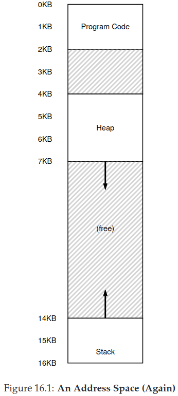
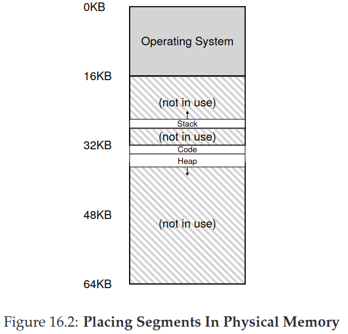
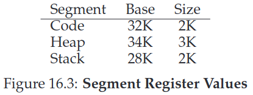
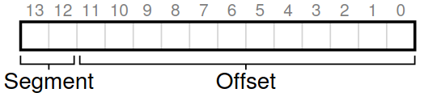
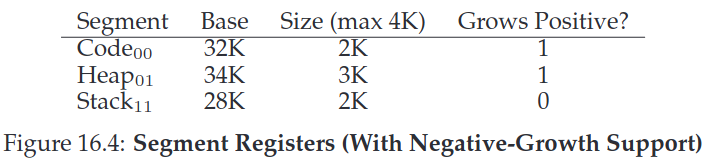
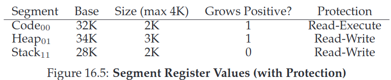
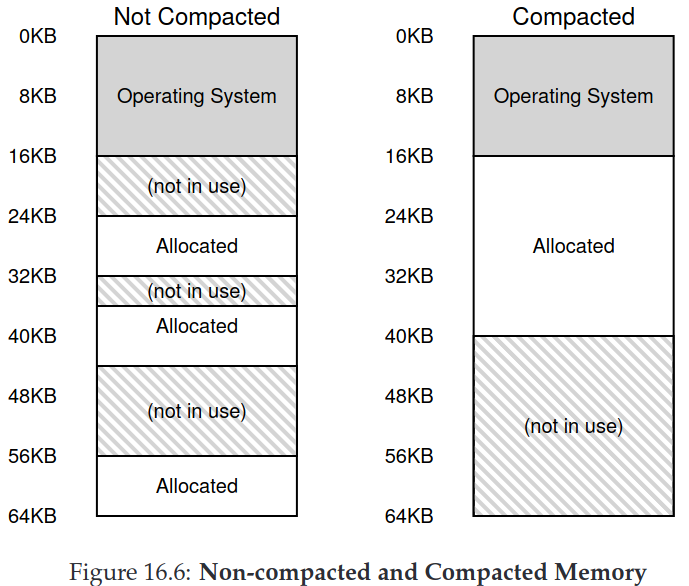

## Chapter 16. Segmentation

In our previous address space, there is big chunk of “free” space right in the middle, between the stack and the heap. As you can imagine from Figure 16.1.  although the space between the stack and heap is not being used by the process, it is still taking up physical memory when we relocate the entire address space somewhere in physical memory; thus, the simple approach of using a base and bounds register pair to virtualize memory is wasteful. It also makes it quite hard to run a program when the entire address space doesn’t fit into memory;



### 16.1 Segmentation: Generalized Base/Bounds

**Segmentation** can be used to solve this problem. Its idea is simple: instead of having just one base and bounds pair in our MMU, why not have a base and bounds pair per logical segment of the address space? A **segment** is just a contiguous portion of the address space of a particular length, and in our canonical address space, we have three logically-different segments: code, stack, and heap. 

For example, we can place each segment *independently* in physical memory, with a base and bounds pair per segment, as shown in Figure 16.2. only used memory is allocated space in physical memory, and thus large address spaces with large amounts of unused address space (which we sometimes call sparse address spaces) can be accommodated.



In this case, a set of three base and bounds register pairs. Figure 16.3 below shows the register values for the example above; each bounds register holds the size of a segment.



The size segment here is exactly the same as the bounds register introduced previously; it tells the hardware exactly how many bytes are valid in this segment (and thus, enables the hardware to determine when a program has made an illegal access outside of those bounds).

In code segment, if virtual address is 100(less than 2K),  the hardware will add the base value to the offset into this segment (100 in this case) to arrive at the desired physical address: 100+32KB = 32868.

In heap segment, virtual address is 4200, we need to first do is extract the *offset* into the heap, which bytes(s) *in this segment* the address refers to. Because the heap starts at virtual address 4KB (4096), the offset of 4200 is actually 4200 minus 4096, or 104. We then take this offset (104) and add it to the base register physical address (34K) to get the desired result: 34920.

What if we tried to refer to an illegal address (i.e., a virtual address of 7KB or greater, the hardware detects that the address is out of bounds, traps into the OS, likely leading to the termination of the offending process. And now you know the origin of the famous term that all C programmers learn to dread: the **segmentation violation** or **segmentation fault**. The term segmentation fault or violation arises from a memory access on a segmented machine to an illegal address. Humorously, the term persists, even on machines with no support for segmentation at all. Or not so humorously, if you can’t figure out why your code keeps faulting.

### 16.2 Which Segment Are We Referring To?

One common approach, sometimes referred to as an **explicit** approach, is to chop up the address space into segments based on the top few bits of the virtual address;  In our example above, we have three segments; thus we need two bits to accomplish our task. If we use the top two bits of our 14-bit virtual address to select the segment, our virtual address looks like this:



If the top bits are 00, the hardware knows the virtual address is in the code segment, if the top bits are 01, the virtual address is in the heap segment. Thus, if base and bounds were arrays (with one entry per segment), the hardware would be doing something like this to obtain the desired physical address:

```c
// get top 2 bits of 14-bit VA
// In our example, SEG_MASK = 0x3000, SEG_SHIFT = 12, OFFSET_MASK = 0xFFF
Segment = (VirtualAddress & SEG_MASK) >> SEG_SHIFT
// now get offset
Offset = VirtualAddress & OFFSET_MASK
if (Offset >= Bounds[Segment])
    RaiseException(PROTECTION_FAULT)
else
    PhysAddr = Base[Segment] + Offset
    Register = AccessMemory(PhysAddr)
```

we only have three segments (code, heap, stack), one segment of the address space goes unused. To fully utilize the virtual address space (and avoid an unused segment), some systems put code in the same segment as the heap and thus use only one bit to select which segment to use.

Another issue with using the top so many bits to select a segment is that it limits use of the virtual address space. Specifically, each segment is limited to a maximum size, which in our example is 4KB.

In the **implicit** approach, the hardware determines the segment by noticing how the address was formed. If, for example, the address was generated from the program counter (i.e., it was an instruction fetch), then the address is within the code segment; if the address is based off of the stack or base pointer, it must be in the stack segment; any other address must be in the heap.

### 16.3 What About The Stack?

The stack has been relocated to physical address 28KB in the diagram above, but with one critical difference: it grows backwards (i.e., towards lower addresses). In physical memory, it “starts” at 28KB and grows back to 26KB, corresponding to virtual addresses 16KB to 14KB; translation must proceed differently.

The first thing we need is a little extra hardware support. Instead of just base and bounds values, the hardware also needs to know which way the segment grows. Our updated view of what the hardware tracks is seen in Figure 16.4:



With the hardware understanding that segments can grow in the negative direction, the hardware must now translate such virtual addresses slightly differently. 

Assume we wish to access virtual address 15KB, which should map to physical address 27KB.  Our virtual address, in binary form, thus looks like this: 11 1100 0000 0000 (hex 0x3C00). The hardware uses the top two bits (11) to designate the segment, but then we are left with an offset of 3KB.  To obtain the correct negative offset, we must subtract the maximum segment size from 3KB: 3KB - 4KB = -1KB, We simply add the negative offset (-1KB) to the base (28KB) to arrive at the correct physical address: 27KB. The bounds check can be calculated by ensuring the absolute value of the negative offset is less than or equal to the segment’s current size (in this case, 2KB).

### 16.4 Support for Sharing

To save memory, sometimes it is useful to **share** certain memory segments between address spaces. In particular, **code sharing** is common and still in use in systems today. To support sharing, we need a little extra support from the hardware, in the form of **protection bits**. Basic support adds a few bits per segment, indicating whether or not a program can read or write a segment, or perhaps execute code that lies within the segment. while each process still thinks that it is accessing its own private memory, the OS is secretly sharing memory which cannot be modified by the process, and thus the illusion is preserved.

An example of the additional information tracked by the hardware (and OS) is shown in Figure 16.5. As you can see, the code segment is set to read and execute, and thus the same physical segment in memory could be mapped into multiple virtual address spaces.



With protection bits, the hardware algorithm described earlier would also have to change. In addition to checking whether a virtual address is within bounds, the hardware also has to check whether a particular access is permissible. If a user process tries to write to a read-only segment, or execute from a non-executable segment, the hardware should raise an exception, and thus let the OS deal with the offending process.

### 16.5 Fine-grained vs. Coarse-grained Segmentation

Most of our examples thus far have focused on systems with just a few segments (i.e., code, stack, heap); we can think of this segmentation as **coarse-grained**, as it chops up the address space into relatively large, coarse chunks. However, some early systems were more flexible and allowed for address spaces to consist of a large number of smaller segments, referred to as **fine-grained** segmentation.

Supporting many segments requires even further hardware support, with a **segment table** of some kind stored in memory. Such segment tables usually support the creation of a very large number of segments, and thus enable a system to use segments in more flexible ways than we have thus far discussed. The thinking at the time was that by having fine-grained segments, the OS could better learn about which segments are in use and which are not and thus utilize main memory more effectively.

### 16.6 OS Support

A huge savings of physical memory is achieved relative to our simpler approach with just a single base/bounds pair for the entire address space. However, segmentation raises a number of new issues for the operating system.

The first is an old one: what should the OS do on a context switch? You should have a good guess by now: the segment registers must be saved and restored. Clearly, each process has its own virtual address space, and the OS must make sure to set up these registers correctly before letting the process run again.

The second is OS interaction when segments grow (or perhaps shrink). For example, a program may call `malloc()` to allocate an object. In
some cases, the existing heap will be able to service the request, and thus `malloc()` will find free space for the object and return a pointer to it to the caller. In others, however, the heap segment itself may need to grow. In this case, the memory-allocation library will perform a system call to grow the heap (e.g., the traditional UNIX sbrk() system call). The OS will then (usually) provide more space, updating the segment size register to the new (bigger) size, and informing the library of success; the library can then allocate space for the new object and return successfully to the calling program. Do note that the OS could reject the request, if no more physical memory is available, or if it decides that the calling process already has too much.

The last, and perhaps most important, issue is managing free space in physical memory. When a new address space is created, the OS has to be able to find space in physical memory for its segments. In the previous chapter, each address space was the same size, and thus physical memory could be thought of as a bunch of slots where processes would fit in. 

The general problem that arises is that physical memory quickly becomes full of little holes of free space, making it difficult to allocate new segments, or to grow existing ones. We call this problem **external fragmentation**.

For example in Figure 16.6(left), a process comes along and wishes to allocate a 20KB segment. In that example, there is 24KB free, but not in one contiguous segment (rather, in three non-contiguous chunks). Thus, the OS cannot satisfy the 20KB request.



One solution to this problem would be to **compact** physical memory by rearranging the existing segments. For example, the OS could stop whichever processes are running, copy their data to one contiguous region of memory, change their segment register values to point to the new physical locations, and thus have a large free extent of memory with which to work. By doing so, the OS enables the new allocation request to succeed. However, compaction is expensive, as copying segments is memory-intensive and generally uses a fair amount of processor time; Compaction also (ironically) makes requests to grow existing segments hard to serve, and may thus cause further rearrangement to accommodate such requests. See Figure 16.6(right) for a diagram of compacted physical memory.

A simpler approach might instead be to use a free-list management algorithm that tries to keep large extents of memory available for allocation. There are literally hundreds of approaches that people have taken, including classic algorithms like **best-fit** (which keeps a list of free spaces and returns the one closest in size that satisfies the desired allocation to the requester), **worst-fit**, **first-fit**, and more complex schemes like **buddy algorithm**. Unfortunately, though, no matter how smart the algorithm, external fragmentation will still exist; thus, a good algorithm simply attempts to minimize it.

### 16.7 Summary

Segmentation solves a number of problems, and helps us build a more effective virtualization of memory. Beyond just dynamic relocation, segmentation can better support sparse address spaces, by avoiding the huge potential waste of memory between logical segments of the address space. It is also fast, as doing the arithmetic segmentation requires is easy and well-suited to hardware; the overheads of translation are minimal. A fringe benefit arises too: code sharing. If code is placed within a separate segment, such a segment could potentially be shared across multiple running programs.

However, as we learned, allocating variable-sized segments in memory leads to some problems that we’d like to overcome. The first, as discussed above, is external fragmentation. Because segments are variable-sized, free memory gets chopped up into odd-sized pieces, and thus satisfying a memory-allocation request can be difficult. One can try to use smart algorithms or periodically compact memory, but the problem is fundamental and hard to avoid. 

The second and perhaps more important problem is that segmentation still isn’t flexible enough to support our fully generalized, sparse address space. For example, if we have a large but sparsely-used heap all in one logical segment, the entire heap must still reside in memory in order to be accessed. In other words, if our model of how the address space is being used doesn’t exactly match how the underlying segmentation has been designed to support it, segmentation doesn’t work very well. We thus need to find some new solutions. Ready to find them?
