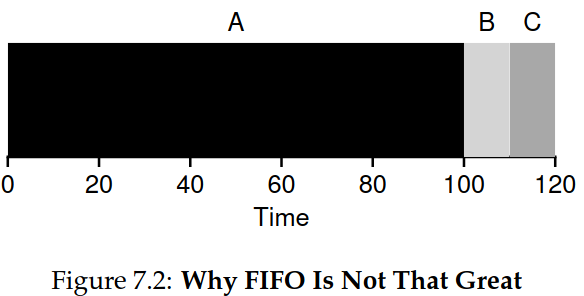

## Chapter 7. Scheduling: Introduction (Note)

This chapter describes a series of **scheduling policies** (sometimes called **disciplines**).

### 7.1 Workload Assumption

**workload**: the collectively processes running in the system.

In this book, author make the following assumptions about the processes, sometimes called **jobs**, that are running in the system:

1. Each job runs for the same amount of time.
2. All jobs arrive at the same time.
3. Once started, each job runs to completion.
4. All jobs only use the CPU (i.e., they perform no I/O)
5. The run-time of each job is known.

### 7.2 Scheduling Metrics

A **scheduling metric** is just something that we use to *measure* something, and there are a number of different metrics that make sense in scheduling.

For now, let us takes a single metric: **turnaround time**. The turnaround time of a job is defined as the time at which the job completes minus the time at which the job arrived in the system. More formally, the turnaround time Tturnaround is:

Tturnaround = Tcompletion - Tarrival

Because we have assumed that all jobs arrive at the same time, for now
Tarrival = 0 and hence Tturnaround = Tcompletion.

You should note that turnaround time is a **performance** metric. Another metric of interest is **fairness**. Performance and fairness are often at odds in scheduling.

### 7.3 First In, First Out (FIFO)

The most basic algorithm we can implement is known as **First In, First Out (FIFO)** scheduling or sometimes **First Come, First Served (FCFS)**. FIFO has a number of positive properties: it is clearly simple and thus easy to implement. 

From Fig 7.1, A,B,C each job runs for 10 seconds. the average turnaround time for three jobs is (10+20+30)/3 = 20.

From Fig 7.2, this time A runs for 100 seconds while B and C run for 10 second each. The average turnaround time is a painful 110 seconds ((100+110+120)/3=110)

This problem is generally referred to as the **convoy effect**.

### 7.4 Shortest Job First (SJF)

This new scheduling discipline is known as **Shortest Job First (SJF)**, and the name should be easy to remember because it describes the policy quite completely: it runs the shortest job first, then the next shortest, and so on.

From Fig 7.3, A runs for 100 seconds while B and C run for 10 second each. The average turnaround time from 110 second to 50 ((10+20+120)/3=50)

If all jobs arrive at the same time, SJF is indeed an **optimal** scheduling algorithm.

However, if jobs does not arrive at the same time, SJF will lead to a problem. From Fig 7.4, A arrives at t = 0 and needs to run for 100 seconds, whereas B and C arrive at t = 10 and each need to run for 10 seconds. The average turnaround time for three jobs is 103.33 second ((100+(110-10)+(120-10))/3=103.33)

### 7.5 Shortest Time-to-Completion First (STCF)

Now, let us relax assumption 3 (that jobs must run to completion). In **non-preemptive** schedulers, system would run each job to completion before considering whether to run a new job. While all modern schedulers are **preemptive**, and quite willing to stop one process from running in order to run another. In particular, the scheduler can perform a context switch, stopping one running process temporarily and resuming (or starting) another.

**Shortest Time-to-Completion First (STCF)** or **Preemptive Shortest Job First (PSJF)**: Any time a new job enters the system, the STCF scheduler determines which of the remaining jobs (including the new job) has the least time left, and schedules that one. 

From Fig 7.5. using above example. The scheduler can certainly do something else when B and C arrive: it can preempt job A and decide to run another job, perhaps continuing A later. . The result is a much-improved average turnaround time: 50 seconds (((120-0)+(20-10)+(30-10))/3)

### 7.6 A New Metric: Response Time

**Response Time**: the time from when the job arrives in a system to the first time it is scheduled. More formally:

Tresponse = Tfirstrun − Tarrival 

For example, Fig 7.6 (with A arriving at time 0, B, C at time 10), the response time of each job is as follows: 0 for job A, 0 for job B, and 10 for job C, the average response time is 3.33.

### 7.7 Round Robin

**Round-Robin(RR)**: its basic idea is simple, instead of running jobs to completion, RR runs a job for a **time slice**(sometimes called **scheduling quantum**) and then switches to the next job in the run queue. It repeatedly does so until the jobs are finished. For this reason, RR is sometimes called **time-slicing**.

For example, Fig 7.7(A, B, C arriving at time 0, and each wish to run 5 seconds), RR with a time-slice of 1 second. The average response time of RR is (0+1+2)/3 = 1; for SJF, average response time: (0+5+10)/3 = 5.

As you can see, the length of the time slice is critical for RR. The shorter it is, the better the performance of RR under the response-time metric. However, making the time slice too short is problematic: suddenly the cost of context switching will dominate overall performance. Thus, deciding on the length of the time slice presents a trade-off to a system designer, making it long enough to **amortize** the cost of switching without making it so long that the system is no longer responsive.

RR, with a reasonable time slice, is thus an excellent scheduler if response time is our only metric. How about turnaround time with RR? Using example above again, A finishes at 13, B at 14, C at 15, the average turnaround time is 14, pretty a awful! RR is indeed one of the *worst* policies if turnaround time is our metric.

More generally, any policy that is **fair**. Indeed, this is an inherent trade-off: if you are willing to be unfair, you can run shorter jobs to completion, but at the cost of response time; if you instead value fairness, response time is lowered, but at the cost of turnaround time. This type of **trade-off** is common in systems; you can’t have your cake and eat it too.

The first type (SJF, STCF) optimizes turnaround time, but is bad for response time. The second type(RR) optimizes response time but is bad for turnaround.

### 7.8 Incorporating I/O

Now we relax assumption 4 — of course all programs perform I/O. A scheduler clearly has a decision to make when a job initiates an I/O request, because jobs don't use CPU during the I/O, it is blocked waiting for I/O completion. The scheduler also has to make a decision when the I/O completes.

Here is an example to show the difference between poor use and overlap, Doing so allows for **overlap**, with the CPU being used by one process while waiting for the I/O of another process to complete; the system is thus better utilized.

### 7.9 No More Oracle

With a basic approach to I/O in place, we come to our final assumption: that the scheduler knows the length of each job. As we said before, this is likely the worst assumption we could make. In fact, in a general-purpose OS (like the ones we care about), the OS usually knows very little about the length of each job. 

### Summary

There are two families of approaches, the first runs the shortest job remaining and thus optimizes turnaround time; the second alternates between all jobs and thus optimizes response time. Both are bad where the other is good, alas, an inherent trade-off common in systems.
