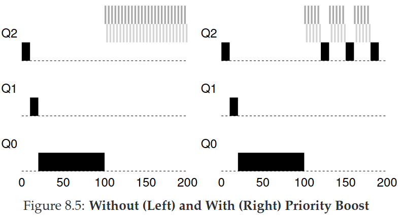

# Chapter 8. Scheduling: The Multi-Level Feedback Queue Homework and Solution (Simulation)

## Homework (Simulation)

This program, [`mlfq.py`](./code/mlfq.py), allows you to see how the MLFQ scheduler presented in this chapter behaves. See the [README](./code/README.md) for details.

## Questions and Solutions

### 8.1

> 1. Run a few randomly-generated problems with just two jobs and two queues; compute the MLFQ execution trace for each. Make your life easier by limiting the length of each job and turning off I/Os.

The program parameters are as follows:

```console
$ python3 mlfq.py -n 2 -j 2 -l 0,20,0:20,30,0
Here is the list of inputs:
OPTIONS jobs 2
OPTIONS queues 2
OPTIONS allotments for queue  1 is   1
OPTIONS quantum length for queue  1 is  10
OPTIONS allotments for queue  0 is   1
OPTIONS quantum length for queue  0 is  10
OPTIONS boost 0
OPTIONS ioTime 5
OPTIONS stayAfterIO False
OPTIONS iobump False


For each job, three defining characteristics are given:
  startTime : at what time does the job enter the system
  runTime   : the total CPU time needed by the job to finish
  ioFreq    : every ioFreq time units, the job issues an I/O
              (the I/O takes ioTime units to complete)

Job List:
  Job  0: startTime   0 - runTime  20 - ioFreq   0
  Job  1: startTime  20 - runTime  30 - ioFreq   0
```

Running result is as follows

```
Time 0~10: job1(queue 1), then down in queue 2
Time 10~20: job2(queue 1), then down in queue 2
Time 20~30: job1(queue 2), finished at 30
Time 30~50: job2(queue 2), finished at 50
```

Code running result is as follows:

```console
$ python3 mlfq.py -n 2 -j 2 -l 0,20,0:10,30,0 -c
Here is the list of inputs:
OPTIONS jobs 2
OPTIONS queues 2
OPTIONS allotments for queue  1 is   1
OPTIONS quantum length for queue  1 is  10
OPTIONS allotments for queue  0 is   1
OPTIONS quantum length for queue  0 is  10
OPTIONS boost 0
OPTIONS ioTime 5
OPTIONS stayAfterIO False
OPTIONS iobump False


For each job, three defining characteristics are given:
  startTime : at what time does the job enter the system
  runTime   : the total CPU time needed by the job to finish
  ioFreq    : every ioFreq time units, the job issues an I/O
              (the I/O takes ioTime units to complete)

Job List:
  Job  0: startTime   0 - runTime  20 - ioFreq   0
  Job  1: startTime  10 - runTime  30 - ioFreq   0


Execution Trace:

[ time 0 ] JOB BEGINS by JOB 0
[ time 0 ] Run JOB 0 at PRIORITY 1 [ TICKS 9 ALLOT 1 TIME 19 (of 20) ]
[ time 1 ] Run JOB 0 at PRIORITY 1 [ TICKS 8 ALLOT 1 TIME 18 (of 20) ]
[ time 2 ] Run JOB 0 at PRIORITY 1 [ TICKS 7 ALLOT 1 TIME 17 (of 20) ]
[ time 3 ] Run JOB 0 at PRIORITY 1 [ TICKS 6 ALLOT 1 TIME 16 (of 20) ]
[ time 4 ] Run JOB 0 at PRIORITY 1 [ TICKS 5 ALLOT 1 TIME 15 (of 20) ]
[ time 5 ] Run JOB 0 at PRIORITY 1 [ TICKS 4 ALLOT 1 TIME 14 (of 20) ]
[ time 6 ] Run JOB 0 at PRIORITY 1 [ TICKS 3 ALLOT 1 TIME 13 (of 20) ]
[ time 7 ] Run JOB 0 at PRIORITY 1 [ TICKS 2 ALLOT 1 TIME 12 (of 20) ]
[ time 8 ] Run JOB 0 at PRIORITY 1 [ TICKS 1 ALLOT 1 TIME 11 (of 20) ]
[ time 9 ] Run JOB 0 at PRIORITY 1 [ TICKS 0 ALLOT 1 TIME 10 (of 20) ]
[ time 10 ] JOB BEGINS by JOB 1
[ time 10 ] Run JOB 1 at PRIORITY 1 [ TICKS 9 ALLOT 1 TIME 29 (of 30) ]
[ time 11 ] Run JOB 1 at PRIORITY 1 [ TICKS 8 ALLOT 1 TIME 28 (of 30) ]
[ time 12 ] Run JOB 1 at PRIORITY 1 [ TICKS 7 ALLOT 1 TIME 27 (of 30) ]
[ time 13 ] Run JOB 1 at PRIORITY 1 [ TICKS 6 ALLOT 1 TIME 26 (of 30) ]
[ time 14 ] Run JOB 1 at PRIORITY 1 [ TICKS 5 ALLOT 1 TIME 25 (of 30) ]
[ time 15 ] Run JOB 1 at PRIORITY 1 [ TICKS 4 ALLOT 1 TIME 24 (of 30) ]
[ time 16 ] Run JOB 1 at PRIORITY 1 [ TICKS 3 ALLOT 1 TIME 23 (of 30) ]
[ time 17 ] Run JOB 1 at PRIORITY 1 [ TICKS 2 ALLOT 1 TIME 22 (of 30) ]
[ time 18 ] Run JOB 1 at PRIORITY 1 [ TICKS 1 ALLOT 1 TIME 21 (of 30) ]
[ time 19 ] Run JOB 1 at PRIORITY 1 [ TICKS 0 ALLOT 1 TIME 20 (of 30) ]
[ time 20 ] Run JOB 0 at PRIORITY 0 [ TICKS 9 ALLOT 1 TIME 9 (of 20) ]
[ time 21 ] Run JOB 0 at PRIORITY 0 [ TICKS 8 ALLOT 1 TIME 8 (of 20) ]
[ time 22 ] Run JOB 0 at PRIORITY 0 [ TICKS 7 ALLOT 1 TIME 7 (of 20) ]
[ time 23 ] Run JOB 0 at PRIORITY 0 [ TICKS 6 ALLOT 1 TIME 6 (of 20) ]
[ time 24 ] Run JOB 0 at PRIORITY 0 [ TICKS 5 ALLOT 1 TIME 5 (of 20) ]
[ time 25 ] Run JOB 0 at PRIORITY 0 [ TICKS 4 ALLOT 1 TIME 4 (of 20) ]
[ time 26 ] Run JOB 0 at PRIORITY 0 [ TICKS 3 ALLOT 1 TIME 3 (of 20) ]
[ time 27 ] Run JOB 0 at PRIORITY 0 [ TICKS 2 ALLOT 1 TIME 2 (of 20) ]
[ time 28 ] Run JOB 0 at PRIORITY 0 [ TICKS 1 ALLOT 1 TIME 1 (of 20) ]
[ time 29 ] Run JOB 0 at PRIORITY 0 [ TICKS 0 ALLOT 1 TIME 0 (of 20) ]
[ time 30 ] FINISHED JOB 0
[ time 30 ] Run JOB 1 at PRIORITY 0 [ TICKS 9 ALLOT 1 TIME 19 (of 30) ]
[ time 31 ] Run JOB 1 at PRIORITY 0 [ TICKS 8 ALLOT 1 TIME 18 (of 30) ]
[ time 32 ] Run JOB 1 at PRIORITY 0 [ TICKS 7 ALLOT 1 TIME 17 (of 30) ]
[ time 33 ] Run JOB 1 at PRIORITY 0 [ TICKS 6 ALLOT 1 TIME 16 (of 30) ]
[ time 34 ] Run JOB 1 at PRIORITY 0 [ TICKS 5 ALLOT 1 TIME 15 (of 30) ]
[ time 35 ] Run JOB 1 at PRIORITY 0 [ TICKS 4 ALLOT 1 TIME 14 (of 30) ]
[ time 36 ] Run JOB 1 at PRIORITY 0 [ TICKS 3 ALLOT 1 TIME 13 (of 30) ]
[ time 37 ] Run JOB 1 at PRIORITY 0 [ TICKS 2 ALLOT 1 TIME 12 (of 30) ]
[ time 38 ] Run JOB 1 at PRIORITY 0 [ TICKS 1 ALLOT 1 TIME 11 (of 30) ]
[ time 39 ] Run JOB 1 at PRIORITY 0 [ TICKS 0 ALLOT 1 TIME 10 (of 30) ]
[ time 40 ] Run JOB 1 at PRIORITY 0 [ TICKS 9 ALLOT 1 TIME 9 (of 30) ]
[ time 41 ] Run JOB 1 at PRIORITY 0 [ TICKS 8 ALLOT 1 TIME 8 (of 30) ]
[ time 42 ] Run JOB 1 at PRIORITY 0 [ TICKS 7 ALLOT 1 TIME 7 (of 30) ]
[ time 43 ] Run JOB 1 at PRIORITY 0 [ TICKS 6 ALLOT 1 TIME 6 (of 30) ]
[ time 44 ] Run JOB 1 at PRIORITY 0 [ TICKS 5 ALLOT 1 TIME 5 (of 30) ]
[ time 45 ] Run JOB 1 at PRIORITY 0 [ TICKS 4 ALLOT 1 TIME 4 (of 30) ]
[ time 46 ] Run JOB 1 at PRIORITY 0 [ TICKS 3 ALLOT 1 TIME 3 (of 30) ]
[ time 47 ] Run JOB 1 at PRIORITY 0 [ TICKS 2 ALLOT 1 TIME 2 (of 30) ]
[ time 48 ] Run JOB 1 at PRIORITY 0 [ TICKS 1 ALLOT 1 TIME 1 (of 30) ]
[ time 49 ] Run JOB 1 at PRIORITY 0 [ TICKS 0 ALLOT 1 TIME 0 (of 30) ]
[ time 50 ] FINISHED JOB 1

Final statistics:
  Job  0: startTime   0 - response   0 - turnaround  30
  Job  1: startTime  10 - response   0 - turnaround  40

  Avg  1: startTime n/a - response 0.00 - turnaround 35.00
```

### 8.2

> 2. How would you run the scheduler to reproduce each of the examples in the chapter?

#### Example 1 (Figure 8.2 Long-running Job Over Time)


The program parameters are as follows.

```console
$ python3 mlfq.py -n 3 -j 1 -l 0,200,0 -c
Here is the list of inputs:
OPTIONS jobs 1
OPTIONS queues 3
OPTIONS allotments for queue  2 is   1
OPTIONS quantum length for queue  2 is  10
OPTIONS allotments for queue  1 is   1
OPTIONS quantum length for queue  1 is  10
OPTIONS allotments for queue  0 is   1
OPTIONS quantum length for queue  0 is  10
OPTIONS boost 0
OPTIONS ioTime 5
OPTIONS stayAfterIO False
OPTIONS iobump False


For each job, three defining characteristics are given:
  startTime : at what time does the job enter the system
  runTime   : the total CPU time needed by the job to finish
  ioFreq    : every ioFreq time units, the job issues an I/O
              (the I/O takes ioTime units to complete)

Job List:
  Job  0: startTime   0 - runTime 200 - ioFreq   0


Execution Trace:

[ time 0 ] JOB BEGINS by JOB 0
[ time 0 ] Run JOB 0 at PRIORITY 2 [ TICKS 9 ALLOT 1 TIME 199 (of 200) ]

# skip...

[ time 9 ] Run JOB 0 at PRIORITY 2 [ TICKS 0 ALLOT 1 TIME 190 (of 200) ]
[ time 10 ] Run JOB 0 at PRIORITY 1 [ TICKS 9 ALLOT 1 TIME 189 (of 200) ]

# skip...

[ time 19 ] Run JOB 0 at PRIORITY 1 [ TICKS 0 ALLOT 1 TIME 180 (of 200) ]
[ time 20 ] Run JOB 0 at PRIORITY 0 [ TICKS 9 ALLOT 1 TIME 179 (of 200) ]
[ time 21 ] Run JOB 0 at PRIORITY 0 [ TICKS 8 ALLOT 1 TIME 178 (of 200) ]

# skip...

[ time 197 ] Run JOB 0 at PRIORITY 0 [ TICKS 2 ALLOT 1 TIME 2 (of 200) ]
[ time 198 ] Run JOB 0 at PRIORITY 0 [ TICKS 1 ALLOT 1 TIME 1 (of 200) ]
[ time 199 ] Run JOB 0 at PRIORITY 0 [ TICKS 0 ALLOT 1 TIME 0 (of 200) ]
[ time 200 ] FINISHED JOB 0

Final statistics:
  Job  0: startTime   0 - response   0 - turnaround 200

  Avg  0: startTime n/a - response 0.00 - turnaround 200.00
```

#### Example 2 (Figure 8.3: Along Came An Interactive Job)


The program parameters are as follows.

```console
$ python3 mlfq.py -n 3 -j 2 -l 0,180,0:100,20,0 -c
Here is the list of inputs:
OPTIONS jobs 2
OPTIONS queues 3
OPTIONS allotments for queue  2 is   1
OPTIONS quantum length for queue  2 is  10
OPTIONS allotments for queue  1 is   1
OPTIONS quantum length for queue  1 is  10
OPTIONS allotments for queue  0 is   1
OPTIONS quantum length for queue  0 is  10
OPTIONS boost 0
OPTIONS ioTime 5
OPTIONS stayAfterIO False
OPTIONS iobump False


For each job, three defining characteristics are given:
  startTime : at what time does the job enter the system
  runTime   : the total CPU time needed by the job to finish
  ioFreq    : every ioFreq time units, the job issues an I/O
              (the I/O takes ioTime units to complete)

Job List:
  Job  0: startTime   0 - runTime 180 - ioFreq   0
  Job  1: startTime 100 - runTime  20 - ioFreq   0


Execution Trace:

[ time 0 ] JOB BEGINS by JOB 0
[ time 0 ] Run JOB 0 at PRIORITY 2 [ TICKS 9 ALLOT 1 TIME 179 (of 180) ]
[ time 1 ] Run JOB 0 at PRIORITY 2 [ TICKS 8 ALLOT 1 TIME 178 (of 180) ]

# skip...

[ time 99 ] Run JOB 0 at PRIORITY 0 [ TICKS 0 ALLOT 1 TIME 80 (of 180) ]
[ time 100 ] JOB BEGINS by JOB 1
[ time 100 ] Run JOB 1 at PRIORITY 2 [ TICKS 9 ALLOT 1 TIME 19 (of 20) ]

# skip...

[ time 109 ] Run JOB 1 at PRIORITY 2 [ TICKS 0 ALLOT 1 TIME 10 (of 20) ]
[ time 110 ] Run JOB 1 at PRIORITY 1 [ TICKS 9 ALLOT 1 TIME 9 (of 20) ]

# skip...

[ time 119 ] Run JOB 1 at PRIORITY 1 [ TICKS 0 ALLOT 1 TIME 0 (of 20) ]
[ time 120 ] FINISHED JOB 1
[ time 120 ] Run JOB 0 at PRIORITY 0 [ TICKS 9 ALLOT 1 TIME 79 (of 180) ]

# skip...

[ time 197 ] Run JOB 0 at PRIORITY 0 [ TICKS 2 ALLOT 1 TIME 2 (of 180) ]
[ time 198 ] Run JOB 0 at PRIORITY 0 [ TICKS 1 ALLOT 1 TIME 1 (of 180) ]
[ time 199 ] Run JOB 0 at PRIORITY 0 [ TICKS 0 ALLOT 1 TIME 0 (of 180) ]
[ time 200 ] FINISHED JOB 0

Final statistics:
  Job  0: startTime   0 - response   0 - turnaround 200
  Job  1: startTime 100 - response   0 - turnaround  20

  Avg  1: startTime n/a - response 0.00 - turnaround 110.00

```

#### Example 3 (Figure 8.4: A Mixed I/O-intensive and CPU-intensive Workload)


Use `-i` flag to set IOTIME. The program parameters are as follows.

```console
$ python3 mlfq.py -n 3 -j 2 -l 0,175,0:50,25,1 -i 4 -c
Here is the list of inputs:
OPTIONS jobs 2
OPTIONS queues 3
OPTIONS allotments for queue  2 is   1
OPTIONS quantum length for queue  2 is  10
OPTIONS allotments for queue  1 is   1
OPTIONS quantum length for queue  1 is  10
OPTIONS allotments for queue  0 is   1
OPTIONS quantum length for queue  0 is  10
OPTIONS boost 0
OPTIONS ioTime 4
OPTIONS stayAfterIO False
OPTIONS iobump False


For each job, three defining characteristics are given:
  startTime : at what time does the job enter the system
  runTime   : the total CPU time needed by the job to finish
  ioFreq    : every ioFreq time units, the job issues an I/O
              (the I/O takes ioTime units to complete)

Job List:
  Job  0: startTime   0 - runTime 175 - ioFreq   0
  Job  1: startTime  50 - runTime  25 - ioFreq   1


Execution Trace:

[ time 0 ] JOB BEGINS by JOB 0
[ time 0 ] Run JOB 0 at PRIORITY 2 [ TICKS 9 ALLOT 1 TIME 174 (of 175) ]

# skip...

[ time 48 ] Run JOB 0 at PRIORITY 0 [ TICKS 1 ALLOT 1 TIME 126 (of 175) ]
[ time 49 ] Run JOB 0 at PRIORITY 0 [ TICKS 0 ALLOT 1 TIME 125 (of 175) ]
[ time 50 ] JOB BEGINS by JOB 1
[ time 50 ] Run JOB 1 at PRIORITY 2 [ TICKS 9 ALLOT 1 TIME 24 (of 25) ]
[ time 51 ] IO_START by JOB 1
IO DONE
[ time 51 ] Run JOB 0 at PRIORITY 0 [ TICKS 9 ALLOT 1 TIME 124 (of 175) ]
[ time 52 ] Run JOB 0 at PRIORITY 0 [ TICKS 8 ALLOT 1 TIME 123 (of 175) ]
[ time 53 ] Run JOB 0 at PRIORITY 0 [ TICKS 7 ALLOT 1 TIME 122 (of 175) ]
[ time 54 ] Run JOB 0 at PRIORITY 0 [ TICKS 6 ALLOT 1 TIME 121 (of 175) ]
[ time 55 ] IO_DONE by JOB 1
[ time 55 ] Run JOB 1 at PRIORITY 2 [ TICKS 8 ALLOT 1 TIME 23 (of 25) ]
[ time 56 ] IO_START by JOB 1
IO DONE
[ time 56 ] Run JOB 0 at PRIORITY 0 [ TICKS 5 ALLOT 1 TIME 120 (of 175) ]
[ time 57 ] Run JOB 0 at PRIORITY 0 [ TICKS 4 ALLOT 1 TIME 119 (of 175) ]
[ time 58 ] Run JOB 0 at PRIORITY 0 [ TICKS 3 ALLOT 1 TIME 118 (of 175) ]
[ time 59 ] Run JOB 0 at PRIORITY 0 [ TICKS 2 ALLOT 1 TIME 117 (of 175) ]
[ time 60 ] IO_DONE by JOB 1
[ time 60 ] Run JOB 1 at PRIORITY 2 [ TICKS 7 ALLOT 1 TIME 22 (of 25) ]
[ time 61 ] IO_START by JOB 1

# skip...

[ time 195 ] Run JOB 0 at PRIORITY 0 [ TICKS 8 ALLOT 1 TIME 3 (of 175) ]
[ time 196 ] Run JOB 0 at PRIORITY 0 [ TICKS 7 ALLOT 1 TIME 2 (of 175) ]
[ time 197 ] Run JOB 0 at PRIORITY 0 [ TICKS 6 ALLOT 1 TIME 1 (of 175) ]
[ time 198 ] IO_DONE by JOB 1
[ time 198 ] Run JOB 0 at PRIORITY 0 [ TICKS 5 ALLOT 1 TIME 0 (of 175) ]
[ time 199 ] FINISHED JOB 0
[ time 199 ] Run JOB 1 at PRIORITY 0 [ TICKS 5 ALLOT 1 TIME 0 (of 25) ]
[ time 200 ] FINISHED JOB 1

Final statistics:
  Job  0: startTime   0 - response   0 - turnaround 199
  Job  1: startTime  50 - response   0 - turnaround 150

  Avg  1: startTime n/a - response 0.00 - turnaround 174.50
```

#### Example 4 (Figure 8.5(Left): Without Priority Boost)



Use `-i` flag to set IOTIME without `-B` flag. The program parameters are as follows.

```console
$ python3 mlfq.py -n 3 -j 3 -l 0,200,0:100,20,2:100,20,2 -i 2 -c
Here is the list of inputs:
OPTIONS jobs 3
OPTIONS queues 3
OPTIONS allotments for queue  2 is   1
OPTIONS quantum length for queue  2 is  10
OPTIONS allotments for queue  1 is   1
OPTIONS quantum length for queue  1 is  10
OPTIONS allotments for queue  0 is   1
OPTIONS quantum length for queue  0 is  10
OPTIONS boost 0
OPTIONS ioTime 2
OPTIONS stayAfterIO False
OPTIONS iobump False


For each job, three defining characteristics are given:
  startTime : at what time does the job enter the system
  runTime   : the total CPU time needed by the job to finish
  ioFreq    : every ioFreq time units, the job issues an I/O
              (the I/O takes ioTime units to complete)

Job List:
  Job  0: startTime   0 - runTime 200 - ioFreq   0
  Job  1: startTime 100 - runTime  20 - ioFreq   2
  Job  2: startTime 100 - runTime  20 - ioFreq   2


Execution Trace:

[ time 0 ] JOB BEGINS by JOB 0
[ time 0 ] Run JOB 0 at PRIORITY 2 [ TICKS 9 ALLOT 1 TIME 199 (of 200) ]

# skip...
# Here is an example of starvation 

[ time 99 ] Run JOB 0 at PRIORITY 0 [ TICKS 0 ALLOT 1 TIME 100 (of 200) ]
[ time 100 ] JOB BEGINS by JOB 1
[ time 100 ] JOB BEGINS by JOB 2
[ time 100 ] Run JOB 1 at PRIORITY 2 [ TICKS 9 ALLOT 1 TIME 19 (of 20) ]
[ time 101 ] Run JOB 1 at PRIORITY 2 [ TICKS 8 ALLOT 1 TIME 18 (of 20) ]
[ time 102 ] IO_START by JOB 1
IO DONE
[ time 102 ] Run JOB 2 at PRIORITY 2 [ TICKS 9 ALLOT 1 TIME 19 (of 20) ]
[ time 103 ] Run JOB 2 at PRIORITY 2 [ TICKS 8 ALLOT 1 TIME 18 (of 20) ]
[ time 104 ] IO_START by JOB 2
IO DONE
[ time 104 ] IO_DONE by JOB 1
[ time 104 ] Run JOB 1 at PRIORITY 2 [ TICKS 7 ALLOT 1 TIME 17 (of 20) ]
[ time 105 ] Run JOB 1 at PRIORITY 2 [ TICKS 6 ALLOT 1 TIME 16 (of 20) ]
[ time 106 ] IO_START by JOB 1
IO DONE
[ time 106 ] IO_DONE by JOB 2
[ time 106 ] Run JOB 2 at PRIORITY 2 [ TICKS 7 ALLOT 1 TIME 17 (of 20) ]
[ time 107 ] Run JOB 2 at PRIORITY 2 [ TICKS 6 ALLOT 1 TIME 16 (of 20) ]
[ time 108 ] IO_START by JOB 2
IO DONE
[ time 108 ] IO_DONE by JOB 1
[ time 108 ] Run JOB 1 at PRIORITY 2 [ TICKS 5 ALLOT 1 TIME 15 (of 20) ]
[ time 109 ] Run JOB 1 at PRIORITY 2 [ TICKS 4 ALLOT 1 TIME 14 (of 20) ]
[ time 110 ] IO_START by JOB 1
IO DONE
[ time 110 ] IO_DONE by JOB 2
[ time 110 ] Run JOB 2 at PRIORITY 2 [ TICKS 5 ALLOT 1 TIME 15 (of 20) ]
[ time 111 ] Run JOB 2 at PRIORITY 2 [ TICKS 4 ALLOT 1 TIME 14 (of 20) ]
[ time 112 ] IO_START by JOB 2
IO DONE
[ time 112 ] IO_DONE by JOB 1
[ time 112 ] Run JOB 1 at PRIORITY 2 [ TICKS 3 ALLOT 1 TIME 13 (of 20) ]
[ time 113 ] Run JOB 1 at PRIORITY 2 [ TICKS 2 ALLOT 1 TIME 12 (of 20) ]
[ time 114 ] IO_START by JOB 1
IO DONE
[ time 114 ] IO_DONE by JOB 2
[ time 114 ] Run JOB 2 at PRIORITY 2 [ TICKS 3 ALLOT 1 TIME 13 (of 20) ]
[ time 115 ] Run JOB 2 at PRIORITY 2 [ TICKS 2 ALLOT 1 TIME 12 (of 20) ]
[ time 116 ] IO_START by JOB 2
IO DONE
[ time 116 ] IO_DONE by JOB 1
[ time 116 ] Run JOB 1 at PRIORITY 2 [ TICKS 1 ALLOT 1 TIME 11 (of 20) ]
[ time 117 ] Run JOB 1 at PRIORITY 2 [ TICKS 0 ALLOT 1 TIME 10 (of 20) ]
[ time 118 ] IO_START by JOB 1
IO DONE
[ time 118 ] IO_DONE by JOB 2
[ time 118 ] Run JOB 2 at PRIORITY 2 [ TICKS 1 ALLOT 1 TIME 11 (of 20) ]
[ time 119 ] Run JOB 2 at PRIORITY 2 [ TICKS 0 ALLOT 1 TIME 10 (of 20) ]
[ time 120 ] IO_START by JOB 2
IO DONE

# skip...

[ time 137 ] Run JOB 1 at PRIORITY 1 [ TICKS 0 ALLOT 1 TIME 0 (of 20) ]
[ time 138 ] FINISHED JOB 1
[ time 138 ] IO_DONE by JOB 2
[ time 138 ] Run JOB 2 at PRIORITY 1 [ TICKS 1 ALLOT 1 TIME 1 (of 20) ]
[ time 139 ] Run JOB 2 at PRIORITY 1 [ TICKS 0 ALLOT 1 TIME 0 (of 20) ]
[ time 140 ] FINISHED JOB 2
[ time 140 ] Run JOB 0 at PRIORITY 0 [ TICKS 9 ALLOT 1 TIME 99 (of 200) ]
[ time 141 ] Run JOB 0 at PRIORITY 0 [ TICKS 8 ALLOT 1 TIME 98 (of 200) ]

# skip...

[ time 239 ] Run JOB 0 at PRIORITY 0 [ TICKS 0 ALLOT 1 TIME 0 (of 200) ]
[ time 240 ] FINISHED JOB 0

Final statistics:
  Job  0: startTime   0 - response   0 - turnaround 240
  Job  1: startTime 100 - response   0 - turnaround  38
  Job  2: startTime 100 - response   2 - turnaround  40

  Avg  2: startTime n/a - response 0.67 - turnaround 106.00
```

#### Example 4 (Figure 8.5(right): With Priority Boost)


Using `-B` flag to set how often to boost the priority of all jobs. The program parameters are as follows.

```console
$ python3 mlfq.py -n 3 -j 3 -l 0,200,0:100,20,2:100,20,2 -i 2 -B 110 -c
Here is the list of inputs:
OPTIONS jobs 3
OPTIONS queues 3
OPTIONS allotments for queue  2 is   1
OPTIONS quantum length for queue  2 is  10
OPTIONS allotments for queue  1 is   1
OPTIONS quantum length for queue  1 is  10
OPTIONS allotments for queue  0 is   1
OPTIONS quantum length for queue  0 is  10
OPTIONS boost 110
OPTIONS ioTime 2
OPTIONS stayAfterIO False
OPTIONS iobump False


For each job, three defining characteristics are given:
  startTime : at what time does the job enter the system
  runTime   : the total CPU time needed by the job to finish
  ioFreq    : every ioFreq time units, the job issues an I/O
              (the I/O takes ioTime units to complete)

Job List:
  Job  0: startTime   0 - runTime 200 - ioFreq   0
  Job  1: startTime 100 - runTime  20 - ioFreq   2
  Job  2: startTime 100 - runTime  20 - ioFreq   2


Execution Trace:

[ time 0 ] JOB BEGINS by JOB 0
[ time 0 ] Run JOB 0 at PRIORITY 2 [ TICKS 9 ALLOT 1 TIME 199 (of 200) ]

# Skip...
# Here is an example of starvation

[ time 99 ] Run JOB 0 at PRIORITY 0 [ TICKS 0 ALLOT 1 TIME 100 (of 200) ]
[ time 100 ] JOB BEGINS by JOB 1
[ time 100 ] JOB BEGINS by JOB 2
[ time 100 ] Run JOB 1 at PRIORITY 2 [ TICKS 9 ALLOT 1 TIME 19 (of 20) ]
[ time 101 ] Run JOB 1 at PRIORITY 2 [ TICKS 8 ALLOT 1 TIME 18 (of 20) ]
[ time 102 ] IO_START by JOB 1
IO DONE
[ time 102 ] Run JOB 2 at PRIORITY 2 [ TICKS 9 ALLOT 1 TIME 19 (of 20) ]
[ time 103 ] Run JOB 2 at PRIORITY 2 [ TICKS 8 ALLOT 1 TIME 18 (of 20) ]
[ time 104 ] IO_START by JOB 2
IO DONE
[ time 104 ] IO_DONE by JOB 1
[ time 104 ] Run JOB 1 at PRIORITY 2 [ TICKS 7 ALLOT 1 TIME 17 (of 20) ]
[ time 105 ] Run JOB 1 at PRIORITY 2 [ TICKS 6 ALLOT 1 TIME 16 (of 20) ]
[ time 106 ] IO_START by JOB 1
IO DONE
[ time 106 ] IO_DONE by JOB 2
[ time 106 ] Run JOB 2 at PRIORITY 2 [ TICKS 7 ALLOT 1 TIME 17 (of 20) ]
[ time 107 ] Run JOB 2 at PRIORITY 2 [ TICKS 6 ALLOT 1 TIME 16 (of 20) ]
[ time 108 ] IO_START by JOB 2
IO DONE
[ time 108 ] IO_DONE by JOB 1
[ time 108 ] Run JOB 1 at PRIORITY 2 [ TICKS 5 ALLOT 1 TIME 15 (of 20) ]
[ time 109 ] Run JOB 1 at PRIORITY 2 [ TICKS 4 ALLOT 1 TIME 14 (of 20) ]
[ time 110 ] IO_START by JOB 1
IO DONE
# Priority Boost
[ time 110 ] BOOST ( every 110 )
[ time 110 ] IO_DONE by JOB 2
[ time 110 ] Run JOB 0 at PRIORITY 2 [ TICKS 0 ALLOT 1 TIME 99 (of 200) ]
[ time 111 ] Run JOB 2 at PRIORITY 2 [ TICKS 0 ALLOT 1 TIME 15 (of 20) ]
[ time 112 ] IO_DONE by JOB 1
[ time 112 ] Run JOB 1 at PRIORITY 2 [ TICKS 0 ALLOT 1 TIME 13 (of 20) ]
[ time 113 ] Run JOB 0 at PRIORITY 1 [ TICKS 9 ALLOT 1 TIME 98 (of 200) ]
[ time 114 ] Run JOB 0 at PRIORITY 1 [ TICKS 8 ALLOT 1 TIME 97 (of 200) ]
[ time 115 ] Run JOB 0 at PRIORITY 1 [ TICKS 7 ALLOT 1 TIME 96 (of 200) ]

# skip...

[ time 239 ] Run JOB 0 at PRIORITY 0 [ TICKS 1 ALLOT 1 TIME 0 (of 200) ]
[ time 240 ] FINISHED JOB 0

Final statistics:
  Job  0: startTime   0 - response   0 - turnaround 240
  Job  1: startTime 100 - response   0 - turnaround  69
  Job  2: startTime 100 - response   2 - turnaround  81

  Avg  2: startTime n/a - response 0.67 - turnaround 130.00
```

#### Example 5 (Figure 8.6(Left): Without Gaming Tolerance)


Using `-S` flag to reset and stay at same priority level when issuing I/O. The program parameters are as follows.

```console
$ python3 mlfq.py -n 3 -j 2 -l 0,200,0:50,45,9 -i 0 -S -c
Here is the list of inputs:
OPTIONS jobs 2
OPTIONS queues 3
OPTIONS allotments for queue  2 is   1
OPTIONS quantum length for queue  2 is  10
OPTIONS allotments for queue  1 is   1
OPTIONS quantum length for queue  1 is  10
OPTIONS allotments for queue  0 is   1
OPTIONS quantum length for queue  0 is  10
OPTIONS boost 0
OPTIONS ioTime 0
OPTIONS stayAfterIO True
OPTIONS iobump False


For each job, three defining characteristics are given:
  startTime : at what time does the job enter the system
  runTime   : the total CPU time needed by the job to finish
  ioFreq    : every ioFreq time units, the job issues an I/O
              (the I/O takes ioTime units to complete)

Job List:
  Job  0: startTime   0 - runTime 200 - ioFreq   0
  Job  1: startTime  50 - runTime  45 - ioFreq   9


Execution Trace:

[ time 0 ] JOB BEGINS by JOB 0
[ time 0 ] Run JOB 0 at PRIORITY 2 [ TICKS 9 ALLOT 1 TIME 199 (of 200) ]

# skip...

[ time 49 ] Run JOB 0 at PRIORITY 0 [ TICKS 0 ALLOT 1 TIME 150 (of 200) ]
[ time 50 ] JOB BEGINS by JOB 1
[ time 50 ] Run JOB 1 at PRIORITY 2 [ TICKS 9 ALLOT 1 TIME 44 (of 45) ]
[ time 51 ] Run JOB 1 at PRIORITY 2 [ TICKS 8 ALLOT 1 TIME 43 (of 45) ]
[ time 52 ] Run JOB 1 at PRIORITY 2 [ TICKS 7 ALLOT 1 TIME 42 (of 45) ]
[ time 53 ] Run JOB 1 at PRIORITY 2 [ TICKS 6 ALLOT 1 TIME 41 (of 45) ]
[ time 54 ] Run JOB 1 at PRIORITY 2 [ TICKS 5 ALLOT 1 TIME 40 (of 45) ]
[ time 55 ] Run JOB 1 at PRIORITY 2 [ TICKS 4 ALLOT 1 TIME 39 (of 45) ]
[ time 56 ] Run JOB 1 at PRIORITY 2 [ TICKS 3 ALLOT 1 TIME 38 (of 45) ]
[ time 57 ] Run JOB 1 at PRIORITY 2 [ TICKS 2 ALLOT 1 TIME 37 (of 45) ]
[ time 58 ] Run JOB 1 at PRIORITY 2 [ TICKS 1 ALLOT 1 TIME 36 (of 45) ]
[ time 59 ] IO_START by JOB 1
IO DONE
[ time 59 ] IO_DONE by JOB 1
[ time 59 ] Run JOB 1 at PRIORITY 2 [ TICKS 9 ALLOT 1 TIME 35 (of 45) ]
[ time 60 ] Run JOB 1 at PRIORITY 2 [ TICKS 8 ALLOT 1 TIME 34 (of 45) ]
[ time 61 ] Run JOB 1 at PRIORITY 2 [ TICKS 7 ALLOT 1 TIME 33 (of 45) ]
[ time 62 ] Run JOB 1 at PRIORITY 2 [ TICKS 6 ALLOT 1 TIME 32 (of 45) ]
[ time 63 ] Run JOB 1 at PRIORITY 2 [ TICKS 5 ALLOT 1 TIME 31 (of 45) ]
[ time 64 ] Run JOB 1 at PRIORITY 2 [ TICKS 4 ALLOT 1 TIME 30 (of 45) ]
[ time 65 ] Run JOB 1 at PRIORITY 2 [ TICKS 3 ALLOT 1 TIME 29 (of 45) ]
[ time 66 ] Run JOB 1 at PRIORITY 2 [ TICKS 2 ALLOT 1 TIME 28 (of 45) ]
[ time 67 ] Run JOB 1 at PRIORITY 2 [ TICKS 1 ALLOT 1 TIME 27 (of 45) ]
[ time 68 ] IO_START by JOB 1
IO DONE
[ time 68 ] IO_DONE by JOB 1
[ time 68 ] Run JOB 1 at PRIORITY 2 [ TICKS 9 ALLOT 1 TIME 26 (of 45) ]

# skip...

[ time 94 ] Run JOB 1 at PRIORITY 2 [ TICKS 1 ALLOT 1 TIME 0 (of 45) ]
[ time 95 ] FINISHED JOB 1
[ time 95 ] Run JOB 0 at PRIORITY 0 [ TICKS 9 ALLOT 1 TIME 149 (of 200) ]

# skip...

[ time 243 ] Run JOB 0 at PRIORITY 0 [ TICKS 1 ALLOT 1 TIME 1 (of 200) ]
[ time 244 ] Run JOB 0 at PRIORITY 0 [ TICKS 0 ALLOT 1 TIME 0 (of 200) ]
[ time 245 ] FINISHED JOB 0

Final statistics:
  Job  0: startTime   0 - response   0 - turnaround 245
  Job  1: startTime  50 - response   0 - turnaround  45

  Avg  1: startTime n/a - response 0.00 - turnaround 145.00
```

#### Example 5 (Figure 8.6(Right): With Gaming Tolerance)


Without `-S` flag. The program parameters are as follows.

```console
$ python3 mlfq.py -n 3 -j 2 -l 0,200,0:50,45,9 -i 0 -c
Here is the list of inputs:
OPTIONS jobs 2
OPTIONS queues 3
OPTIONS allotments for queue  2 is   1
OPTIONS quantum length for queue  2 is  10
OPTIONS allotments for queue  1 is   1
OPTIONS quantum length for queue  1 is  10
OPTIONS allotments for queue  0 is   1
OPTIONS quantum length for queue  0 is  10
OPTIONS boost 0
OPTIONS ioTime 0
OPTIONS stayAfterIO False
OPTIONS iobump False


For each job, three defining characteristics are given:
  startTime : at what time does the job enter the system
  runTime   : the total CPU time needed by the job to finish
  ioFreq    : every ioFreq time units, the job issues an I/O
              (the I/O takes ioTime units to complete)

Job List:
  Job  0: startTime   0 - runTime 200 - ioFreq   0
  Job  1: startTime  50 - runTime  45 - ioFreq   9


Execution Trace:

[ time 0 ] JOB BEGINS by JOB 0
[ time 0 ] Run JOB 0 at PRIORITY 2 [ TICKS 9 ALLOT 1 TIME 199 (of 200) ]

# skip...

[ time 49 ] Run JOB 0 at PRIORITY 0 [ TICKS 0 ALLOT 1 TIME 150 (of 200) ]
[ time 50 ] JOB BEGINS by JOB 1
[ time 50 ] Run JOB 1 at PRIORITY 2 [ TICKS 9 ALLOT 1 TIME 44 (of 45) ]
[ time 51 ] Run JOB 1 at PRIORITY 2 [ TICKS 8 ALLOT 1 TIME 43 (of 45) ]
[ time 52 ] Run JOB 1 at PRIORITY 2 [ TICKS 7 ALLOT 1 TIME 42 (of 45) ]
[ time 53 ] Run JOB 1 at PRIORITY 2 [ TICKS 6 ALLOT 1 TIME 41 (of 45) ]
[ time 54 ] Run JOB 1 at PRIORITY 2 [ TICKS 5 ALLOT 1 TIME 40 (of 45) ]
[ time 55 ] Run JOB 1 at PRIORITY 2 [ TICKS 4 ALLOT 1 TIME 39 (of 45) ]
[ time 56 ] Run JOB 1 at PRIORITY 2 [ TICKS 3 ALLOT 1 TIME 38 (of 45) ]
[ time 57 ] Run JOB 1 at PRIORITY 2 [ TICKS 2 ALLOT 1 TIME 37 (of 45) ]
[ time 58 ] Run JOB 1 at PRIORITY 2 [ TICKS 1 ALLOT 1 TIME 36 (of 45) ]
[ time 59 ] IO_START by JOB 1
IO DONE
[ time 59 ] IO_DONE by JOB 1
[ time 59 ] Run JOB 1 at PRIORITY 2 [ TICKS 0 ALLOT 1 TIME 35 (of 45) ]
[ time 60 ] Run JOB 1 at PRIORITY 1 [ TICKS 9 ALLOT 1 TIME 34 (of 45) ]
[ time 61 ] Run JOB 1 at PRIORITY 1 [ TICKS 8 ALLOT 1 TIME 33 (of 45) ]
[ time 62 ] Run JOB 1 at PRIORITY 1 [ TICKS 7 ALLOT 1 TIME 32 (of 45) ]
[ time 63 ] Run JOB 1 at PRIORITY 1 [ TICKS 6 ALLOT 1 TIME 31 (of 45) ]
[ time 64 ] Run JOB 1 at PRIORITY 1 [ TICKS 5 ALLOT 1 TIME 30 (of 45) ]
[ time 65 ] Run JOB 1 at PRIORITY 1 [ TICKS 4 ALLOT 1 TIME 29 (of 45) ]
[ time 66 ] Run JOB 1 at PRIORITY 1 [ TICKS 3 ALLOT 1 TIME 28 (of 45) ]
[ time 67 ] Run JOB 1 at PRIORITY 1 [ TICKS 2 ALLOT 1 TIME 27 (of 45) ]
[ time 68 ] IO_START by JOB 1
IO DONE
[ time 68 ] IO_DONE by JOB 1
[ time 68 ] Run JOB 1 at PRIORITY 1 [ TICKS 1 ALLOT 1 TIME 26 (of 45) ]
[ time 69 ] Run JOB 1 at PRIORITY 1 [ TICKS 0 ALLOT 1 TIME 25 (of 45) ]
[ time 70 ] Run JOB 0 at PRIORITY 0 [ TICKS 9 ALLOT 1 TIME 149 (of 200) ]
[ time 71 ] Run JOB 0 at PRIORITY 0 [ TICKS 8 ALLOT 1 TIME 148 (of 200) ]
[ time 72 ] Run JOB 0 at PRIORITY 0 [ TICKS 7 ALLOT 1 TIME 147 (of 200) ]
[ time 73 ] Run JOB 0 at PRIORITY 0 [ TICKS 6 ALLOT 1 TIME 146 (of 200) ]
[ time 74 ] Run JOB 0 at PRIORITY 0 [ TICKS 5 ALLOT 1 TIME 145 (of 200) ]
[ time 75 ] Run JOB 0 at PRIORITY 0 [ TICKS 4 ALLOT 1 TIME 144 (of 200) ]
[ time 76 ] Run JOB 0 at PRIORITY 0 [ TICKS 3 ALLOT 1 TIME 143 (of 200) ]
[ time 77 ] Run JOB 0 at PRIORITY 0 [ TICKS 2 ALLOT 1 TIME 142 (of 200) ]
[ time 78 ] Run JOB 0 at PRIORITY 0 [ TICKS 1 ALLOT 1 TIME 141 (of 200) ]
[ time 79 ] Run JOB 0 at PRIORITY 0 [ TICKS 0 ALLOT 1 TIME 140 (of 200) ]
[ time 80 ] Run JOB 1 at PRIORITY 0 [ TICKS 9 ALLOT 1 TIME 24 (of 45) ]
[ time 81 ] Run JOB 1 at PRIORITY 0 [ TICKS 8 ALLOT 1 TIME 23 (of 45) ]
[ time 82 ] Run JOB 1 at PRIORITY 0 [ TICKS 7 ALLOT 1 TIME 22 (of 45) ]
[ time 83 ] Run JOB 1 at PRIORITY 0 [ TICKS 6 ALLOT 1 TIME 21 (of 45) ]
[ time 84 ] Run JOB 1 at PRIORITY 0 [ TICKS 5 ALLOT 1 TIME 20 (of 45) ]
[ time 85 ] Run JOB 1 at PRIORITY 0 [ TICKS 4 ALLOT 1 TIME 19 (of 45) ]
[ time 86 ] Run JOB 1 at PRIORITY 0 [ TICKS 3 ALLOT 1 TIME 18 (of 45) ]
[ time 87 ] IO_START by JOB 1
IO DONE
[ time 87 ] IO_DONE by JOB 1
[ time 87 ] Run JOB 0 at PRIORITY 0 [ TICKS 9 ALLOT 1 TIME 139 (of 200) ]

# skip...

[ time 243 ] Run JOB 0 at PRIORITY 0 [ TICKS 1 ALLOT 1 TIME 1 (of 200) ]
[ time 244 ] Run JOB 0 at PRIORITY 0 [ TICKS 0 ALLOT 1 TIME 0 (of 200) ]
[ time 245 ] FINISHED JOB 0

Final statistics:
  Job  0: startTime   0 - response   0 - turnaround 245
  Job  1: startTime  50 - response   0 - turnaround  95

  Avg  1: startTime n/a - response 0.00 - turnaround 170.00
```

#### Example 6 (Figure 8.7: Lower Priority, Longer Quanta)


Using `-Q a,b,c` to specify length of time slice per queue level. The program parameters are as follows.

```console
$ python3 mlfq.py -n 3 -j 2 -l 0,150,0:10,150,0 -Q 10,20,30 -c
Here is the list of inputs:
OPTIONS jobs 2
OPTIONS queues 3
OPTIONS allotments for queue  2 is   1
OPTIONS quantum length for queue  2 is  10
OPTIONS allotments for queue  1 is   1
OPTIONS quantum length for queue  1 is  20
OPTIONS allotments for queue  0 is   1
OPTIONS quantum length for queue  0 is  30
OPTIONS boost 0
OPTIONS ioTime 5
OPTIONS stayAfterIO False
OPTIONS iobump False


For each job, three defining characteristics are given:
  startTime : at what time does the job enter the system
  runTime   : the total CPU time needed by the job to finish
  ioFreq    : every ioFreq time units, the job issues an I/O
              (the I/O takes ioTime units to complete)

Job List:
  Job  0: startTime   0 - runTime 150 - ioFreq   0
  Job  1: startTime  10 - runTime 150 - ioFreq   0


Execution Trace:

[ time 0 ] JOB BEGINS by JOB 0
[ time 0 ] Run JOB 0 at PRIORITY 2 [ TICKS 9 ALLOT 1 TIME 149 (of 150) ]

# skip...

[ time 9 ] Run JOB 0 at PRIORITY 2 [ TICKS 0 ALLOT 1 TIME 140 (of 150) ]
[ time 10 ] JOB BEGINS by JOB 1
[ time 10 ] Run JOB 1 at PRIORITY 2 [ TICKS 9 ALLOT 1 TIME 149 (of 150) ]

# skip...

[ time 19 ] Run JOB 1 at PRIORITY 2 [ TICKS 0 ALLOT 1 TIME 140 (of 150) ]
[ time 20 ] Run JOB 0 at PRIORITY 1 [ TICKS 19 ALLOT 1 TIME 139 (of 150) ]

# skip...

[ time 39 ] Run JOB 0 at PRIORITY 1 [ TICKS 0 ALLOT 1 TIME 120 (of 150) ]
[ time 40 ] Run JOB 1 at PRIORITY 1 [ TICKS 19 ALLOT 1 TIME 139 (of 150) ]

# skip...

[ time 58 ] Run JOB 1 at PRIORITY 1 [ TICKS 1 ALLOT 1 TIME 121 (of 150) ]
[ time 59 ] Run JOB 1 at PRIORITY 1 [ TICKS 0 ALLOT 1 TIME 120 (of 150) ]
[ time 60 ] Run JOB 0 at PRIORITY 0 [ TICKS 29 ALLOT 1 TIME 119 (of 150) ]

# skip...

[ time 87 ] Run JOB 0 at PRIORITY 0 [ TICKS 2 ALLOT 1 TIME 92 (of 150) ]
[ time 88 ] Run JOB 0 at PRIORITY 0 [ TICKS 1 ALLOT 1 TIME 91 (of 150) ]
[ time 89 ] Run JOB 0 at PRIORITY 0 [ TICKS 0 ALLOT 1 TIME 90 (of 150) ]
[ time 90 ] Run JOB 1 at PRIORITY 0 [ TICKS 29 ALLOT 1 TIME 119 (of 150) ]

# skip...

[ time 118 ] Run JOB 1 at PRIORITY 0 [ TICKS 1 ALLOT 1 TIME 91 (of 150) ]
[ time 119 ] Run JOB 1 at PRIORITY 0 [ TICKS 0 ALLOT 1 TIME 90 (of 150) ]
[ time 120 ] Run JOB 0 at PRIORITY 0 [ TICKS 29 ALLOT 1 TIME 89 (of 150) ]

# skip...

[ time 299 ] Run JOB 1 at PRIORITY 0 [ TICKS 0 ALLOT 1 TIME 0 (of 150) ]
[ time 300 ] FINISHED JOB 1

Final statistics:
  Job  0: startTime   0 - response   0 - turnaround 270
  Job  1: startTime  10 - response   0 - turnaround 290

  Avg  1: startTime n/a - response 0.00 - turnaround 280.00
```

### 8.3

> 3. How would you configure the scheduler parameters to behave just like a round-robin scheduler?

There is only one queue (by `-n 1`), and setting time slice <= (max job length) / (the number of jobs).

The program parameters are as follows.

```console
$ python3 mlfq.py -n 1 -j 3 -l 0,50,0:0,50,0:0,50,0 -Q 1 -c   
Here is the list of inputs:
OPTIONS jobs 3
OPTIONS queues 1
OPTIONS allotments for queue  0 is   1
OPTIONS quantum length for queue  0 is   1
OPTIONS boost 0
OPTIONS ioTime 5
OPTIONS stayAfterIO False
OPTIONS iobump False


For each job, three defining characteristics are given:
  startTime : at what time does the job enter the system
  runTime   : the total CPU time needed by the job to finish
  ioFreq    : every ioFreq time units, the job issues an I/O
              (the I/O takes ioTime units to complete)

Job List:
  Job  0: startTime   0 - runTime  50 - ioFreq   0
  Job  1: startTime   0 - runTime  50 - ioFreq   0
  Job  2: startTime   0 - runTime  50 - ioFreq   0


Execution Trace:

[ time 0 ] JOB BEGINS by JOB 0
[ time 0 ] JOB BEGINS by JOB 1
[ time 0 ] JOB BEGINS by JOB 2
[ time 0 ] Run JOB 0 at PRIORITY 0 [ TICKS 0 ALLOT 1 TIME 49 (of 50) ]
[ time 1 ] Run JOB 1 at PRIORITY 0 [ TICKS 0 ALLOT 1 TIME 49 (of 50) ]
[ time 2 ] Run JOB 2 at PRIORITY 0 [ TICKS 0 ALLOT 1 TIME 49 (of 50) ]
[ time 3 ] Run JOB 0 at PRIORITY 0 [ TICKS 0 ALLOT 1 TIME 48 (of 50) ]
[ time 4 ] Run JOB 1 at PRIORITY 0 [ TICKS 0 ALLOT 1 TIME 48 (of 50) ]
[ time 5 ] Run JOB 2 at PRIORITY 0 [ TICKS 0 ALLOT 1 TIME 48 (of 50) ]
[ time 6 ] Run JOB 0 at PRIORITY 0 [ TICKS 0 ALLOT 1 TIME 47 (of 50) ]
[ time 7 ] Run JOB 1 at PRIORITY 0 [ TICKS 0 ALLOT 1 TIME 47 (of 50) ]

# skip...

[ time 147 ] Run JOB 0 at PRIORITY 0 [ TICKS 0 ALLOT 1 TIME 0 (of 50) ]
[ time 148 ] FINISHED JOB 0
[ time 148 ] Run JOB 1 at PRIORITY 0 [ TICKS 0 ALLOT 1 TIME 0 (of 50) ]
[ time 149 ] FINISHED JOB 1
[ time 149 ] Run JOB 2 at PRIORITY 0 [ TICKS 0 ALLOT 1 TIME 0 (of 50) ]
[ time 150 ] FINISHED JOB 2
```

### 8.4

> 4. Craft a workload with two jobs and scheduler parameters so that one job takes advantage of the older Rules 4a and 4b (turned on with the `-S` flag) to game the scheduler and obtain 99% of the CPU over a particular time interval.

This question just like Figure 8.6 (Right) without gaming tolerance. So its solution is the same as example 5 in 8.2. The program parameters are as follows.

```console
$ python3 mlfq.py -n 3 -j 2 -l 0,200,0:50,45,9 -i 0 -S -c
Here is the list of inputs:
OPTIONS jobs 2
OPTIONS queues 3
OPTIONS allotments for queue  2 is   1
OPTIONS quantum length for queue  2 is  10
OPTIONS allotments for queue  1 is   1
OPTIONS quantum length for queue  1 is  10
OPTIONS allotments for queue  0 is   1
OPTIONS quantum length for queue  0 is  10
OPTIONS boost 0
OPTIONS ioTime 0
OPTIONS stayAfterIO True
OPTIONS iobump False


For each job, three defining characteristics are given:
  startTime : at what time does the job enter the system
  runTime   : the total CPU time needed by the job to finish
  ioFreq    : every ioFreq time units, the job issues an I/O
              (the I/O takes ioTime units to complete)

Job List:
  Job  0: startTime   0 - runTime 200 - ioFreq   0
  Job  1: startTime  50 - runTime  45 - ioFreq   9


Execution Trace:

[ time 0 ] JOB BEGINS by JOB 0
[ time 0 ] Run JOB 0 at PRIORITY 2 [ TICKS 9 ALLOT 1 TIME 199 (of 200) ]

# skip...

[ time 49 ] Run JOB 0 at PRIORITY 0 [ TICKS 0 ALLOT 1 TIME 150 (of 200) ]
[ time 50 ] JOB BEGINS by JOB 1
[ time 50 ] Run JOB 1 at PRIORITY 2 [ TICKS 9 ALLOT 1 TIME 44 (of 45) ]
[ time 51 ] Run JOB 1 at PRIORITY 2 [ TICKS 8 ALLOT 1 TIME 43 (of 45) ]
[ time 52 ] Run JOB 1 at PRIORITY 2 [ TICKS 7 ALLOT 1 TIME 42 (of 45) ]
[ time 53 ] Run JOB 1 at PRIORITY 2 [ TICKS 6 ALLOT 1 TIME 41 (of 45) ]
[ time 54 ] Run JOB 1 at PRIORITY 2 [ TICKS 5 ALLOT 1 TIME 40 (of 45) ]
[ time 55 ] Run JOB 1 at PRIORITY 2 [ TICKS 4 ALLOT 1 TIME 39 (of 45) ]
[ time 56 ] Run JOB 1 at PRIORITY 2 [ TICKS 3 ALLOT 1 TIME 38 (of 45) ]
[ time 57 ] Run JOB 1 at PRIORITY 2 [ TICKS 2 ALLOT 1 TIME 37 (of 45) ]
[ time 58 ] Run JOB 1 at PRIORITY 2 [ TICKS 1 ALLOT 1 TIME 36 (of 45) ]
[ time 59 ] IO_START by JOB 1
IO DONE
[ time 59 ] IO_DONE by JOB 1
[ time 59 ] Run JOB 1 at PRIORITY 2 [ TICKS 9 ALLOT 1 TIME 35 (of 45) ]
[ time 60 ] Run JOB 1 at PRIORITY 2 [ TICKS 8 ALLOT 1 TIME 34 (of 45) ]
[ time 61 ] Run JOB 1 at PRIORITY 2 [ TICKS 7 ALLOT 1 TIME 33 (of 45) ]
[ time 62 ] Run JOB 1 at PRIORITY 2 [ TICKS 6 ALLOT 1 TIME 32 (of 45) ]
[ time 63 ] Run JOB 1 at PRIORITY 2 [ TICKS 5 ALLOT 1 TIME 31 (of 45) ]
[ time 64 ] Run JOB 1 at PRIORITY 2 [ TICKS 4 ALLOT 1 TIME 30 (of 45) ]
[ time 65 ] Run JOB 1 at PRIORITY 2 [ TICKS 3 ALLOT 1 TIME 29 (of 45) ]
[ time 66 ] Run JOB 1 at PRIORITY 2 [ TICKS 2 ALLOT 1 TIME 28 (of 45) ]
[ time 67 ] Run JOB 1 at PRIORITY 2 [ TICKS 1 ALLOT 1 TIME 27 (of 45) ]
[ time 68 ] IO_START by JOB 1
IO DONE
[ time 68 ] IO_DONE by JOB 1
[ time 68 ] Run JOB 1 at PRIORITY 2 [ TICKS 9 ALLOT 1 TIME 26 (of 45) ]

# skip...

[ time 94 ] Run JOB 1 at PRIORITY 2 [ TICKS 1 ALLOT 1 TIME 0 (of 45) ]
[ time 95 ] FINISHED JOB 1
[ time 95 ] Run JOB 0 at PRIORITY 0 [ TICKS 9 ALLOT 1 TIME 149 (of 200) ]

# skip...

[ time 243 ] Run JOB 0 at PRIORITY 0 [ TICKS 1 ALLOT 1 TIME 1 (of 200) ]
[ time 244 ] Run JOB 0 at PRIORITY 0 [ TICKS 0 ALLOT 1 TIME 0 (of 200) ]
[ time 245 ] FINISHED JOB 0

Final statistics:
  Job  0: startTime   0 - response   0 - turnaround 245
  Job  1: startTime  50 - response   0 - turnaround  45

  Avg  1: startTime n/a - response 0.00 - turnaround 145.00
```

### 8.5

> 5. Given a system with a quantum length of 10 ms in its highest queue, how often would you have to boost jobs back to the highest priority level (with the `-B` flag) in order to guarantee that a single long-running (and potentially-starving) job gets at least 5% of the CPU?

200ms. Because the problem requires a job to occupy at least 5% of the CPU, and the highest queue time slice is 10ms, so at least every 10 / 5% = 200ms to boost job back to the highest priority.

### 8.6

> 6. One question that arises in scheduling is which end of a queue to add a job that just finished I/O; the `-I` flag changes this behavior for this scheduling simulator. Play around with some workloads and see if you can see the effect of this flag.

Use `-I` flag will pause current running job, start such job that just finished I/O.

Here is an example **without** `-I`.

```console
$ python3 mlfq.py -n 2 -j 2 -l 0,100,0:0,50,5 -i 2 -c
Here is the list of inputs:
OPTIONS jobs 2
OPTIONS queues 2
OPTIONS allotments for queue  1 is   1
OPTIONS quantum length for queue  1 is  10
OPTIONS allotments for queue  0 is   1
OPTIONS quantum length for queue  0 is  10
OPTIONS boost 0
OPTIONS ioTime 2
OPTIONS stayAfterIO False
OPTIONS iobump False


For each job, three defining characteristics are given:
  startTime : at what time does the job enter the system
  runTime   : the total CPU time needed by the job to finish
  ioFreq    : every ioFreq time units, the job issues an I/O
              (the I/O takes ioTime units to complete)

Job List:
  Job  0: startTime   0 - runTime 100 - ioFreq   0
  Job  1: startTime   0 - runTime  50 - ioFreq   5


Execution Trace:

[ time 0 ] JOB BEGINS by JOB 0
[ time 0 ] JOB BEGINS by JOB 1
[ time 0 ] Run JOB 0 at PRIORITY 1 [ TICKS 9 ALLOT 1 TIME 99 (of 100) ]

# skip...

[ time 14 ] Run JOB 1 at PRIORITY 1 [ TICKS 5 ALLOT 1 TIME 45 (of 50) ]
[ time 15 ] IO_START by JOB 1
IO DONE
[ time 15 ] Run JOB 0 at PRIORITY 0 [ TICKS 9 ALLOT 1 TIME 89 (of 100) ]
[ time 16 ] Run JOB 0 at PRIORITY 0 [ TICKS 8 ALLOT 1 TIME 88 (of 100) ]
[ time 17 ] IO_DONE by JOB 1
[ time 17 ] Run JOB 1 at PRIORITY 1 [ TICKS 4 ALLOT 1 TIME 44 (of 50) ]
[ time 18 ] Run JOB 1 at PRIORITY 1 [ TICKS 3 ALLOT 1 TIME 43 (of 50) ]
[ time 19 ] Run JOB 1 at PRIORITY 1 [ TICKS 2 ALLOT 1 TIME 42 (of 50) ]
[ time 20 ] Run JOB 1 at PRIORITY 1 [ TICKS 1 ALLOT 1 TIME 41 (of 50) ]
[ time 21 ] Run JOB 1 at PRIORITY 1 [ TICKS 0 ALLOT 1 TIME 40 (of 50) ]
[ time 22 ] IO_START by JOB 1
IO DONE
[ time 22 ] Run JOB 0 at PRIORITY 0 [ TICKS 7 ALLOT 1 TIME 87 (of 100) ]
[ time 23 ] Run JOB 0 at PRIORITY 0 [ TICKS 6 ALLOT 1 TIME 86 (of 100) ]
[ time 24 ] IO_DONE by JOB 1
# It won't pause JOB 0 running
[ time 24 ] Run JOB 0 at PRIORITY 0 [ TICKS 5 ALLOT 1 TIME 85 (of 100) ]
[ time 25 ] Run JOB 0 at PRIORITY 0 [ TICKS 4 ALLOT 1 TIME 84 (of 100) ]
[ time 26 ] Run JOB 0 at PRIORITY 0 [ TICKS 3 ALLOT 1 TIME 83 (of 100) ]
[ time 27 ] Run JOB 0 at PRIORITY 0 [ TICKS 2 ALLOT 1 TIME 82 (of 100) ]
[ time 28 ] Run JOB 0 at PRIORITY 0 [ TICKS 1 ALLOT 1 TIME 81 (of 100) ]
[ time 29 ] Run JOB 0 at PRIORITY 0 [ TICKS 0 ALLOT 1 TIME 80 (of 100) ]
[ time 30 ] Run JOB 1 at PRIORITY 0 [ TICKS 9 ALLOT 1 TIME 39 (of 50) ]
[ time 31 ] Run JOB 1 at PRIORITY 0 [ TICKS 8 ALLOT 1 TIME 38 (of 50) ]
[ time 32 ] Run JOB 1 at PRIORITY 0 [ TICKS 7 ALLOT 1 TIME 37 (of 50) ]
[ time 33 ] Run JOB 1 at PRIORITY 0 [ TICKS 6 ALLOT 1 TIME 36 (of 50) ]
[ time 34 ] Run JOB 1 at PRIORITY 0 [ TICKS 5 ALLOT 1 TIME 35 (of 50) ]
[ time 35 ] IO_START by JOB 1

# skip...

[ time 148 ] Run JOB 0 at PRIORITY 0 [ TICKS 1 ALLOT 1 TIME 1 (of 100) ]
[ time 149 ] Run JOB 0 at PRIORITY 0 [ TICKS 0 ALLOT 1 TIME 0 (of 100) ]
[ time 150 ] FINISHED JOB 0

Final statistics:
  Job  0: startTime   0 - response   0 - turnaround 150
  Job  1: startTime   0 - response  10 - turnaround 140

  Avg  1: startTime n/a - response 5.00 - turnaround 145.00

```

Here is an example **with** `-I` flag.

```console
$ python3 mlfq.py -n 2 -j 2 -l 0,100,0:0,50,5 -i 2 -S -I -c
Here is the list of inputs:
OPTIONS jobs 2
OPTIONS queues 2
OPTIONS allotments for queue  1 is   1
OPTIONS quantum length for queue  1 is  10
OPTIONS allotments for queue  0 is   1
OPTIONS quantum length for queue  0 is  10
OPTIONS boost 0
OPTIONS ioTime 2
OPTIONS stayAfterIO True
OPTIONS iobump True


For each job, three defining characteristics are given:
  startTime : at what time does the job enter the system
  runTime   : the total CPU time needed by the job to finish
  ioFreq    : every ioFreq time units, the job issues an I/O
              (the I/O takes ioTime units to complete)

Job List:
  Job  0: startTime   0 - runTime 100 - ioFreq   0
  Job  1: startTime   0 - runTime  50 - ioFreq   5


Execution Trace:

[ time 0 ] JOB BEGINS by JOB 0
[ time 0 ] JOB BEGINS by JOB 1
[ time 0 ] Run JOB 0 at PRIORITY 1 [ TICKS 9 ALLOT 1 TIME 99 (of 100) ]

# skip...

[ time 14 ] Run JOB 1 at PRIORITY 1 [ TICKS 5 ALLOT 1 TIME 45 (of 50) ]
[ time 15 ] IO_START by JOB 1
IO DONE
[ time 15 ] Run JOB 0 at PRIORITY 0 [ TICKS 9 ALLOT 1 TIME 89 (of 100) ]
[ time 16 ] Run JOB 0 at PRIORITY 0 [ TICKS 8 ALLOT 1 TIME 88 (of 100) ]
[ time 17 ] IO_DONE by JOB 1
# It will pause JOB 0 and then start run JOB 1
[ time 17 ] Run JOB 1 at PRIORITY 1 [ TICKS 9 ALLOT 1 TIME 44 (of 50) ]
[ time 18 ] Run JOB 1 at PRIORITY 1 [ TICKS 8 ALLOT 1 TIME 43 (of 50) ]
[ time 19 ] Run JOB 1 at PRIORITY 1 [ TICKS 7 ALLOT 1 TIME 42 (of 50) ]
[ time 20 ] Run JOB 1 at PRIORITY 1 [ TICKS 6 ALLOT 1 TIME 41 (of 50) ]
[ time 21 ] Run JOB 1 at PRIORITY 1 [ TICKS 5 ALLOT 1 TIME 40 (of 50) ]
[ time 22 ] IO_START by JOB 1

# skip...

[ time 148 ] Run JOB 0 at PRIORITY 0 [ TICKS 1 ALLOT 1 TIME 1 (of 100) ]
[ time 149 ] Run JOB 0 at PRIORITY 0 [ TICKS 0 ALLOT 1 TIME 0 (of 100) ]
[ time 150 ] FINISHED JOB 0

Final statistics:
  Job  0: startTime   0 - response   0 - turnaround 150
  Job  1: startTime   0 - response  10 - turnaround  78

  Avg  1: startTime n/a - response 5.00 - turnaround 114.00
```
