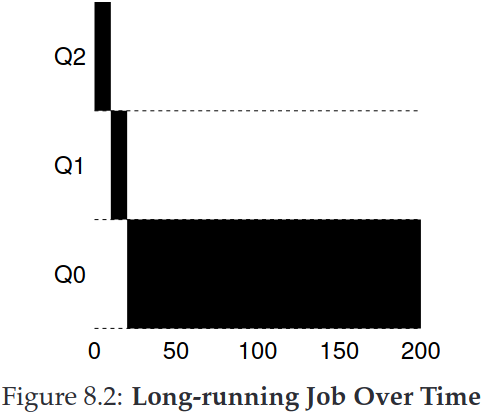

## Chapter 8. Scheduling: The Multi-Level Feedback Queue (Note)

The **Multi-Level Feedback Queue(MLFQ)** was first described by Corbato(Turing Award 1990) et al. in 1962.

The fundamental problem MLFQ tries to address is two-fold. Without a *priori*
knowledge of job length , First, it would like to optimize *turnaround time*. Second, MLFQ would like to make a system fell responsive to interactive users and thus minimize *response time*. 

The multi-level feedback queue is an excellent example of a system that
learns from the past to predict the future. 

### 8.1 MLFQ: Basic Rules

The MLFQ has a number of distinct **queues**, each assigned a different **priority level**. MLFQ uses priorities to decide which job should run at a given time: a job with higher priority (i.e., a job on a higher queue) is chosen to run. Of course, more than one job may be on a given queue, and thus have the same priority. In this case, we will just use round-robin scheduling among those jobs.

The first two basic rules for MLFQ:
- **Rule 1**: If Priority(A) > Priority(B), A runs (B doesn't)
- **Rule 2**: If Priority(A) = Priority(B), A & B run in RR.

Rather than giving a fixed priority to each job, MLFQ *varies* the priority of a job based on its *observed behavior*. If, for example, a job repeatedly relinquishes the CPU while waiting for input from the keyboard, MLFQ will keep its priority high, as this is how an interactive process might behave. If, instead, a job uses the CPU intensively for long periods of time, MLFQ will reduce its priority. In this way, MLFQ will try to *learn* about processes as they run, and thus use the *history* of the job to predict its *future* behavior.

### 8.2 Attempt #1: How To Change Priority

We must keep in mind our workload: a mix of interactive jobs that are short-running (and may frequently relinquish the CPU), and some longer-running “CPU-bound” jobs that need a lot of CPU time but where response time isn’t important. Here is our first attempt at a priority-adjustment algorithm:

- **Rule 3**: When a job enters the system, it is placed at the highest priority(the topmost queue)
- **Rule 4a**: If a jobs uses up an entire time slice while running, its priority is *reduced* (i.e, it moves down one queue)
- **Rule 4b**: If a job gives up the CPU before the time slice is up, it stays at the *same* priority level.

#### Example 1: A Single Long-Running Job

Figure 8.2 shows a single long-running job in MLFQ. the job enters at the highest priority (Q2). After a single time-slice of 10 ms, the scheduler reduces the job’s priority by one, and thus the job is on Q1. After running at Q1 for a time slice, the job is finally lowered to the lowest priority in the system (Q0), where it remains.

#### Example 2: Along Came A Short Job

In this example, there are two jobs: A, which is a long-running CPU-intensive job, and B, which is a short-running interactive job. 

Figure 8.3 plots the results of this scenario. A (shown in black) is running along in the lowest-priority queue (as would any long-running CPU-intensive jobs); B (shown in gray) arrives at time T = 100, and thus is inserted into the highest queue; as its run-time is short (only 20 ms), B completes before reaching the bottom queue, in two time slices; then A resumes running (at low priority).

The major goals of the algorithm: because it doesn’t know whether a job will be a short job or a long-running job, it first assumes it might be a short job, thus giving the job high priority. If it actually is a short job, it will run quickly and complete; if it is not a short job, it will slowly move down the queues, and thus soon prove itself to be a long-running more batch-like process. In this manner, MLFQ approximates SJF.

#### Example 3: What About I/O?

As Rule 4b states above,  if an interactive job, for example, is doing a lot of I/O (say by waiting for user input from the keyboard or mouse), it will relinquish the CPU before its time slice is complete.

Figure 8.4 shows an example of how this works, with an interactive job B (shown in gray) that needs the CPU only for 1 ms before performing an I/O competing for the CPU with a long-running batch job A (shown in black). The MLFQ approach keeps B at the highest priority because B keeps releasing the CPU; if B is an interactive job, MLFQ further achieves its goal of running interactive jobs quickly.

#### Problems with Our Current MLFQ

First, there is the problem of **starvation**: if there are “too many” interactive jobs in the system, they will combine to consume all CPU time, and thus long-running jobs will never receive any CPU time (they starve).

Second, a smart user could rewrite their program to **game the scheduler**. The algorithm we have described is susceptible to the following attack: before the time slice is over, issue an I/O operation (to some file you don’t care about) and thus relinquish the CPU; doing so allows you to remain in the same queue, and thus gain a higher percentage of CPU time. When done right (e.g., by running for 99% of a time slice before relinquishing the CPU), a job could nearly monopolize the CPU.

Finally, a program may *change its behavior* over time;

### 8.3 Attempt #2: The Priority Boost

The simple idea here is to periodically **boost** the priority of all the jobs in system. There are many ways to achieve this, but let’s just do something simple: throw them all in the topmost queue; hence, a new rule:

- **Rule 5**: After some time period S, move all the jobs in the system to topmost queue.

Such new rule solves two problems mentioned above at once. First, processes are guaranteed not to starve: by sitting in the top queue, a job will share the CPU with other high-priority jobs in a round-robin fashion, and thus eventually receive service. Second, if a CPU-bound job has become interactive, the scheduler treats it properly once it has received the priority boost.

Figure 8.5 shows an example. On the left, there is no priority boost, and thus the long-running job gets starved once the two short jobs arrive; on the right, there is a priority boost every 50 ms and thus we at least guarantee that the long-running job will make some progress, getting boosted to the highest priority every 50 ms and thus getting to run periodically.

There is an obvious question: what should S be set to?  John Ousterhout used to call such values in systems voo-doo constants, because they seemed to require some form of black magic to set them correctly. Unfortunately, S has that flavor. If it is set too high, long-running jobs could starve; too low, and interactive jobs may not get a proper share of the CPU. TIP: Avoid voo-doo constants is a good idea whenever possible(**Ousterhout’s Law**) **(TODO Why?)**

### 8.4 Attempt #3: Better Accounting

How to prevent gaming of our scheduler? The solution here is to perform better accounting of CPU time at each level of the MLFQ. Instead of forgetting how much of a time slice a process used at a given level, the scheduler should keep track; once a process has used its allotment, it is demoted to the next priority queue. Whether it uses the time slice in one long burst or many small ones does not matter. We thus rewrite Rules 4a and 4b to the following single rule:

- **Rule 4**: Once a job uses up its time allotment at a given level (regardless of how many times it has given up the CPU), its priority is reduced (i.e, it moves down one queue).

Figure 8.6 shows an example what happens when a workload tries to game the scheduler with the old Rules 4a and 4b (on the left) as well the new anti-gaming Rule 4. Without any protection from gaming, a process can issue an I/O just before a time slice ends and thus dominate CPU time. With such protections in place, regardless of the I/O behavior of the process, it slowly moves down the queues, and thus cannot gain an unfair share of the CPU.

### 8.5 Tuning MLFQ And Other Issues

One big question is how to **parameterize** such a scheduler. For example, how many queues should there be? How big should the time slice be per queue? How often should priority be boosted in order to avoid starvation and account for changes in behavior? There are no easy answers to these questions, and thus only some experience with workloads and subsequent tuning of the scheduler will lead to a satisfactory balance.

For example, most MLFQ variants allow for varying time-slice length across different queues. The high-priority queues are usually given short time slices, they are comprised of interactive jobs, after all, and thus quickly alternating between them makes sense. The low-priority queues, in contrast, contain long-running jobs that are CPU-bound; hence, longer time slices work well. As Figure 8.7 shown.

Solaris MLFQ implementation -- Default values for the table are 60 queues, with slowly increasing time-slice lengths from 20 milliseconds (highest priority) to a few hundred milliseconds (lowest), and priorities boosted around every 1 second or so.

FreeBSD scheduler use a formula to calculate the current priority level of a job, basing it on how much CPU the process has used.

Finally,  many schedulers have a few other features that you might encounter. For example, some schedulers reverse the highest priority levels for operating system work. Some systems also provide interfaces to allow users or administrators to provide some hints to help the OS set priorities(e.g. with `nice`, `madvise`).

### 8.6 MLFQ: Summary

Multi-Level Feedback Queue(MLFQ) has multiple levels of queues, and uses feedback to determine the priority of a given job. History is its guide: pay attention to how jobs
behave over time and treat them accordingly.

The refined set of MLFQ rules, spread throughout the chapter, are reproduced here for your viewing pleasure:
- Rule 1: If Priority(A) > Priority(B), A runs (B doesn’t).
- Rule 2: If Priority(A) = Priority(B), A & B run in round-robin fashion using the time slice (quantum length) of the given queue.
- Rule 3: When a job enters the system, it is placed at the highest priority (the topmost queue).
- Rule 4: Once a job uses up its time allotment at a given level (regardless of how many times it has given up the CPU), its priority is reduced (i.e., it moves down one queue).
- Rule 5: After some time period S, move all the jobs in the system to the topmost queue.

MLFQ is interesting for the following reason: instead of demanding a priori knowledge of the nature of a job, it observes the execution of a job and prioritizes it accordingly. 
